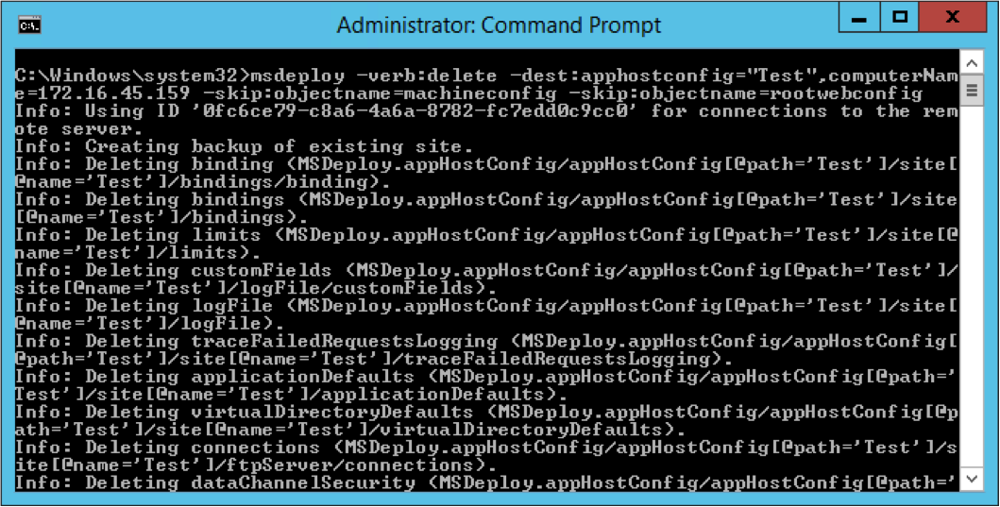

如要使用 Web Deploy 刪除遠端站台，可以指定 Web Deploy 使用 delete 操作，dest 使用 appHostConfig provider，並帶入要刪除的站台名稱，及用 computerName provider setting 指定遠端電腦的位置。

msdeploy –verb:delete –dest:apphostconfig="",computerName=

