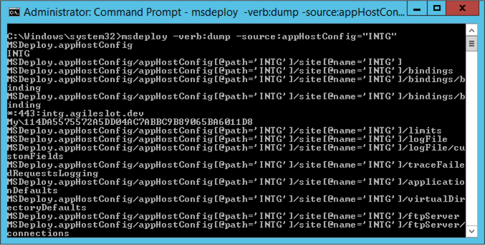

如要使用 Web Deploy 將本地站台資訊 dump 出來，可以指定 Web Deploy 使用 dump 操作，因為站台的指定是用 appHostConfig provider，所以將 source 指定為 appHostConfig provider，並帶入站台的名稱即可。

<!-- More -->

    msdeploy -verb:dump -source:appHostConfig="<SourceSite>"

 

 
