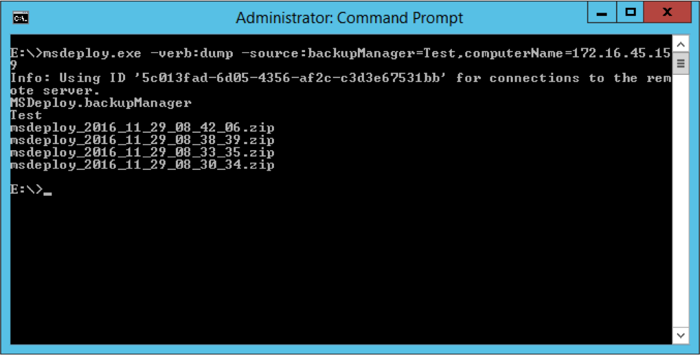
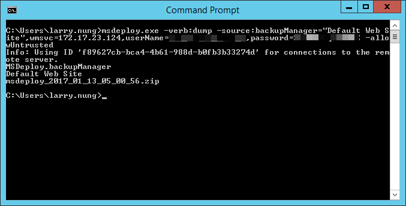

如要使用 Web Deploy 將遠端可以使用的備份資訊 dump 出來，可以指定 Web Deploy 使用 dump 操作，source 使用 backupManager，帶入要查詢的站台名稱。

透過 Remote Agent Service 去做遠端電腦連線的話，dest 這邊要使用 computerName provider setting 去指定遠端電腦的位置。

msdeploy.exe -verb:dump -source:backupManager=,computerName=

如果要透過 Web Management Service 去做遠端電腦連線的話，則 dest 這邊要使用 wmsvc provider setting 去指定遠端電腦的位置。

msdeploy.exe -verb:dump -source:backupManager=,wmsvc=,userName=,password= -allowUntrusted

