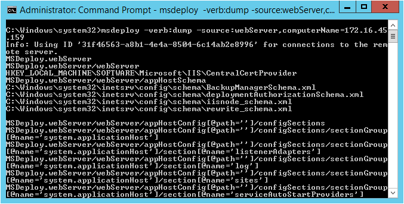
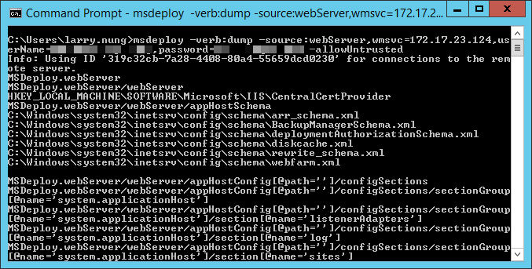

如要使用 Web Deploy 將遠端 server 資訊 dump 出來，可以指定 Web Deploy 使用 dump 操作，將 source 指定為 WebServer provider。

透過 Remote Agent Service 去做遠端電腦連線的話，dest 這邊要使用 computerName provider setting 去指定遠端電腦的位置。

msdeploy -verb:dump -source:webServer,computerName=

如果要透過 Web Management Service 去做遠端電腦連線的話，則 dest 這邊要使用 wmsvc provider setting 去指定遠端電腦的位置。

msdeploy -verb:dump -source:webServer,wmsvc=,userName=,password= -allowUntrusted

