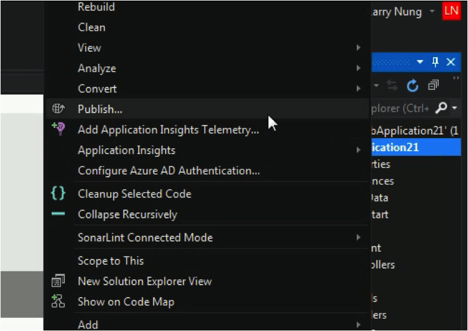
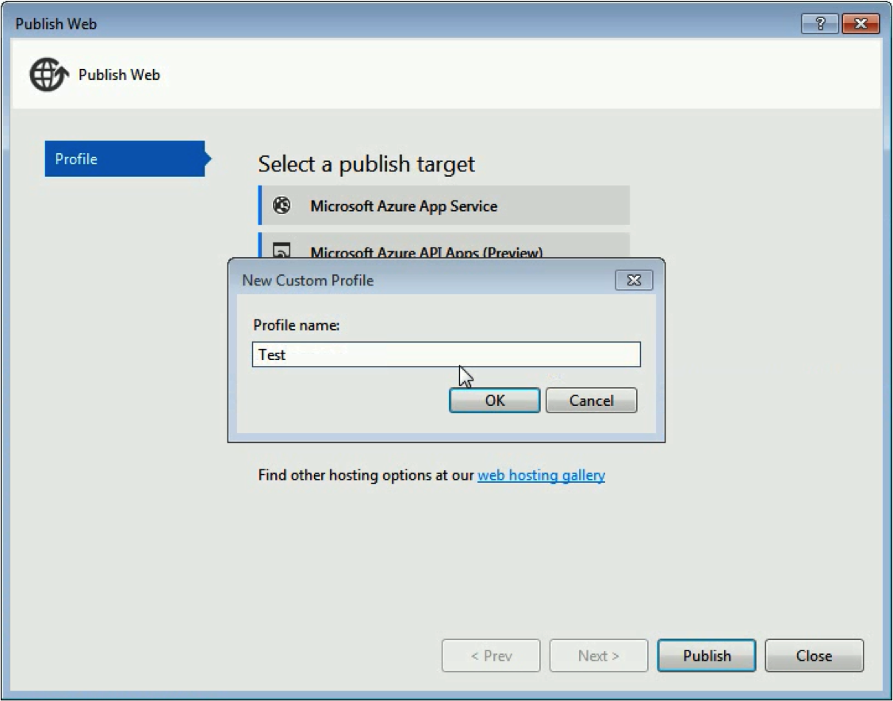
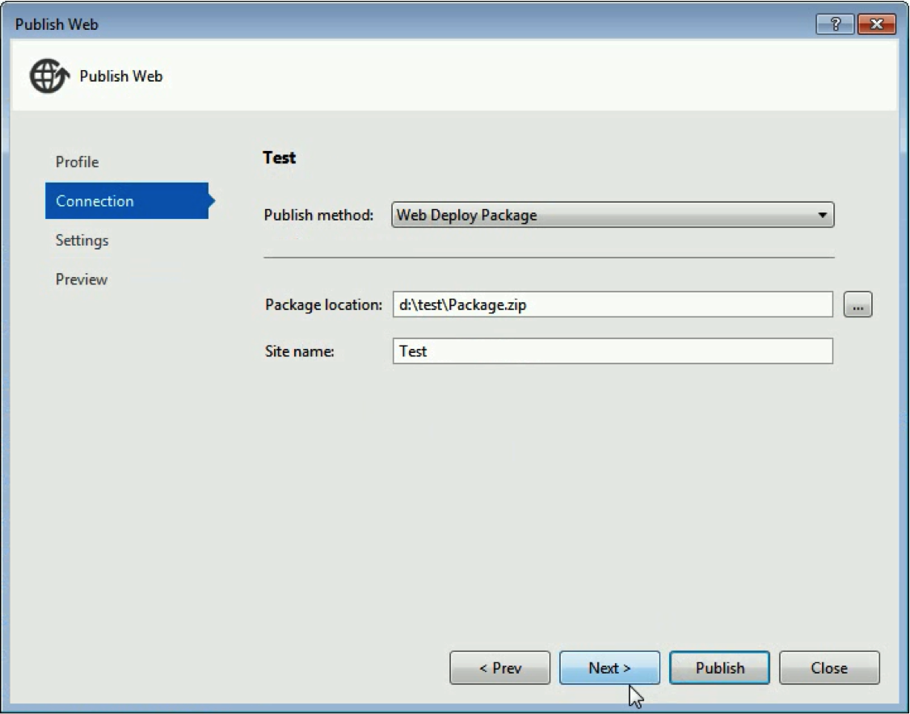
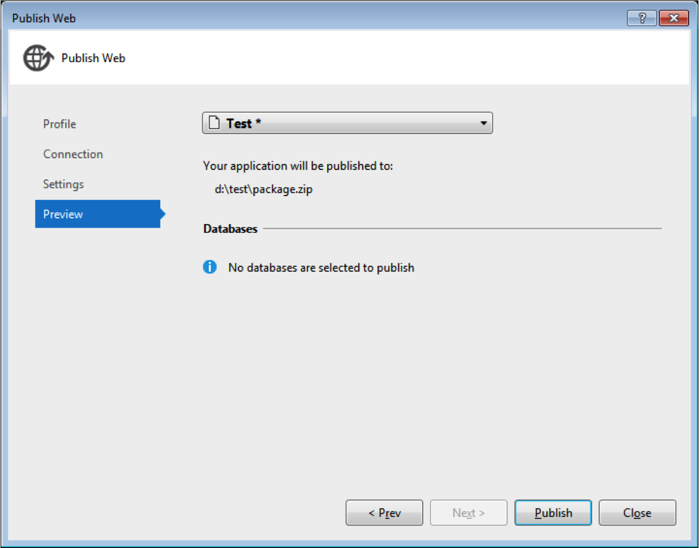
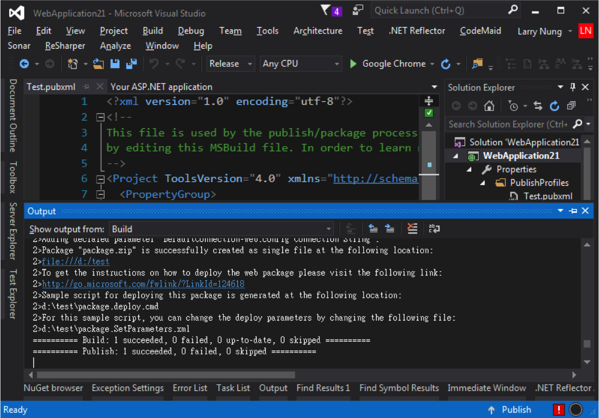
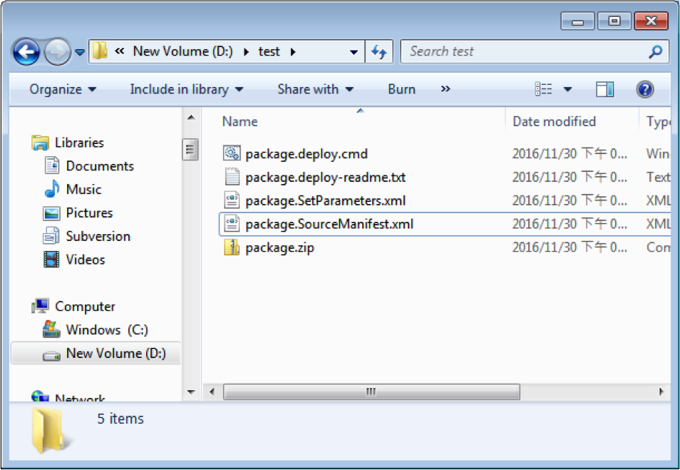

要使用 Visual Studio 建立 Web Deploy package，首先在方案總管的專案上按下滑鼠右鍵，點選 `Publish...` 滑鼠右鍵選單選項。  

<!-- More -->

 

在 Publish Web 視窗中選取 Cuetom Profile。  

 

設定 Profile 的名稱。  

 

接著 Publish method 選定 Web Deploy Package，設定 Package 放置的位置以及要佈署的站台名稱。    

 

再來選定要建置的 Configuration。  

 

進行發佈。  

 

 

發佈完成就可以在指定的位置看到產出的 Web Deploy package。  

 
