Web Deploy 程式可至微軟網站下載。  

<!-- More -->

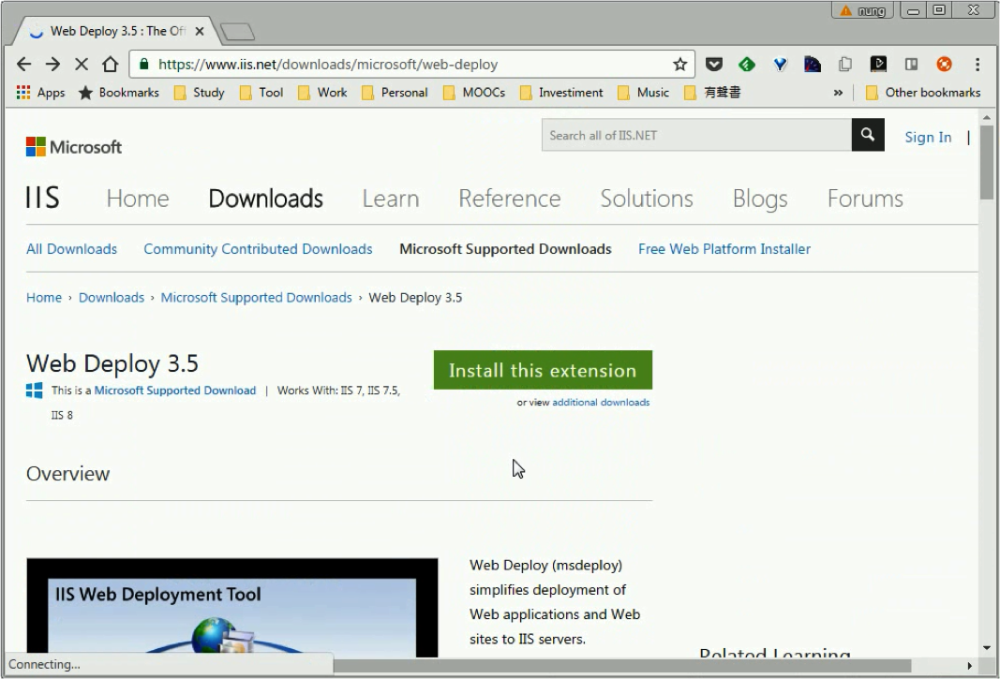

 

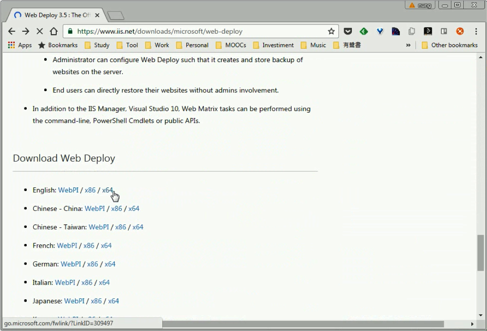

 

下載完點擊安裝。  

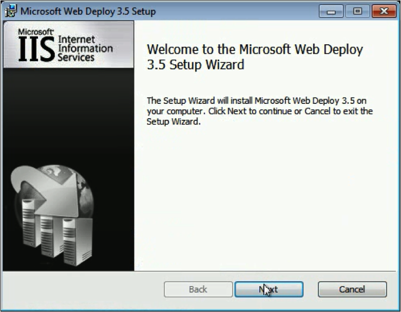

 

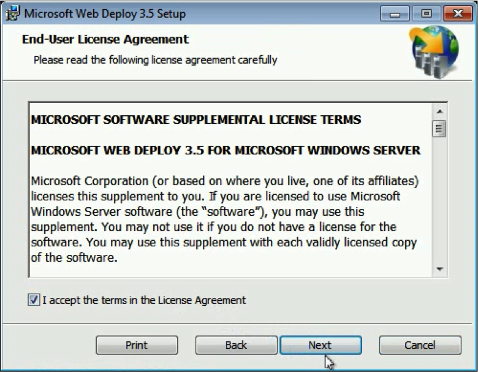

 

 

安裝類型建議選取 Custom，確認一下要安裝的元件。  

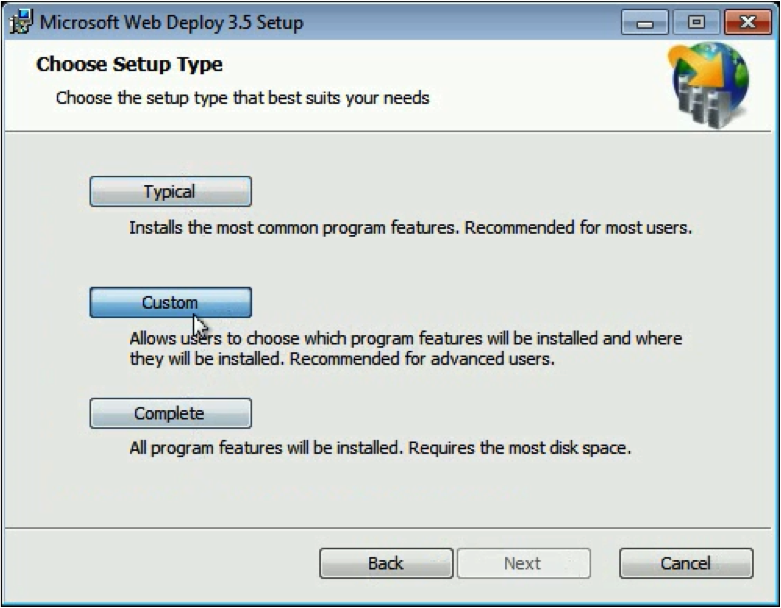

 

這邊的元件有 IIS Manager UI 模組，安裝完會將 Web Deploy 部分功能整合在 IIS Manager。比較重要的需要確認 Management Service 與 Remote Agent Service 的安裝狀況，因為 Web Deploy 佈署時可能會走這兩條路 ，所以需要視需要將之勾選安裝。  

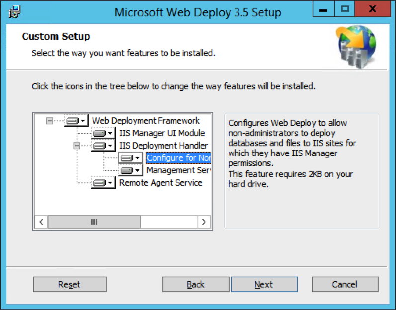

 

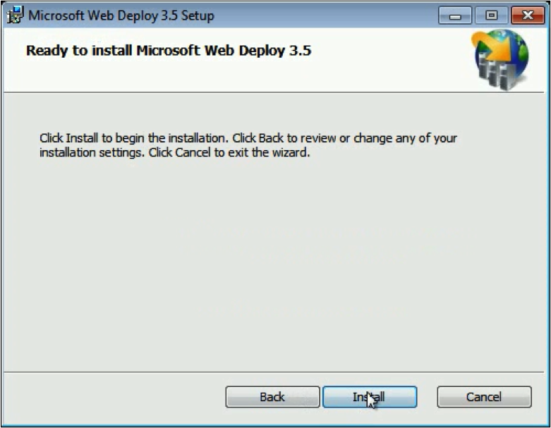

 

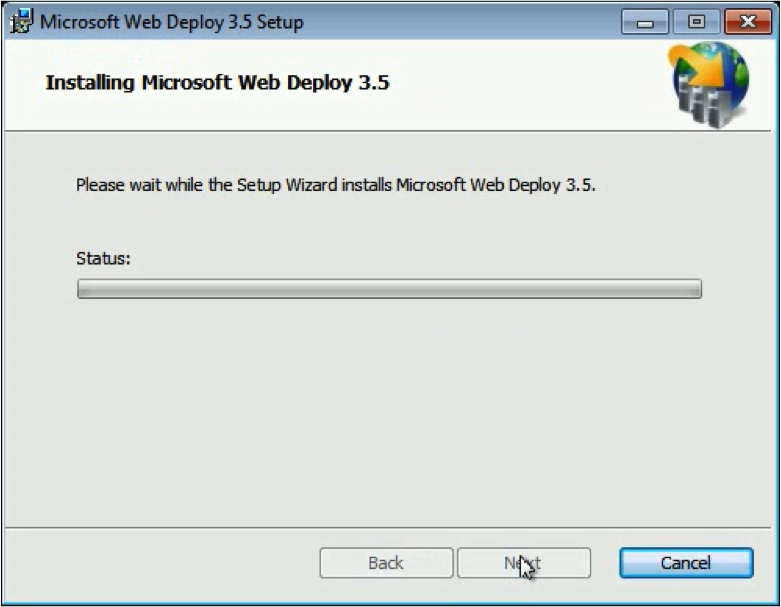

 

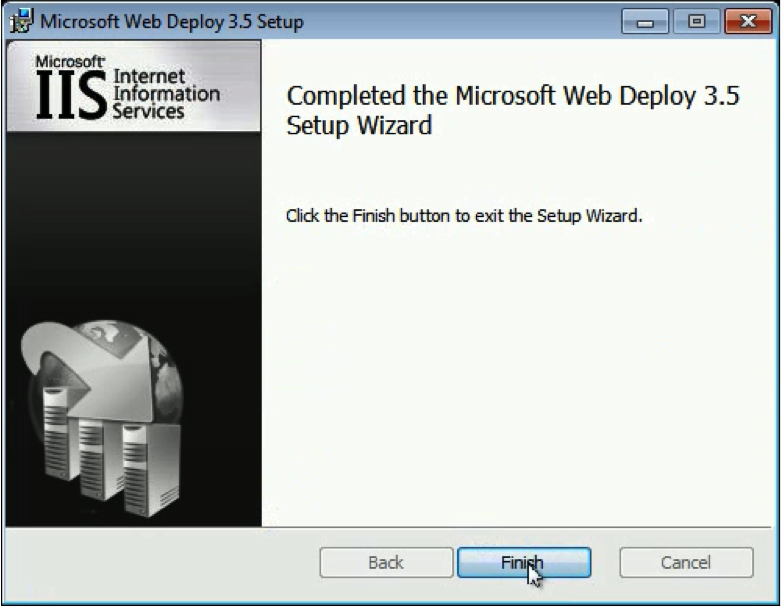

 

如果剛有選取 Manager Service 或是 Remote Agent Service，安裝完就可以看到系統內會有新增對應的服務(Web Management Service 與 Web Deployment Agent Service)，我們需要確保服務是正常啟用的。  

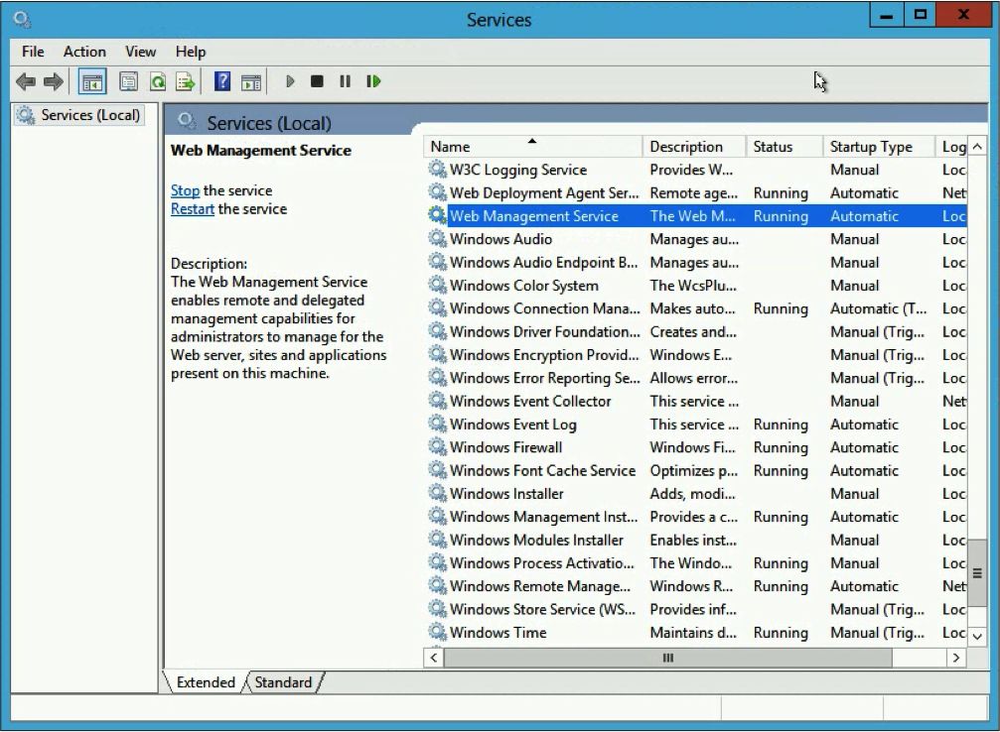

 

除了確定服務啟動外，也可以開啟瀏覽器訪問 `http://localhost/MSDEPLOYAGENTSERVICE` 去驗證 Remote Agent Service 是否正常運作。  

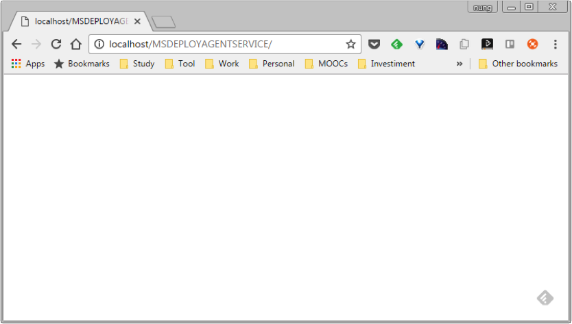

 

至於 Manager Service 這邊，可以開啟 IIS Manager 的 `Management Service`。  

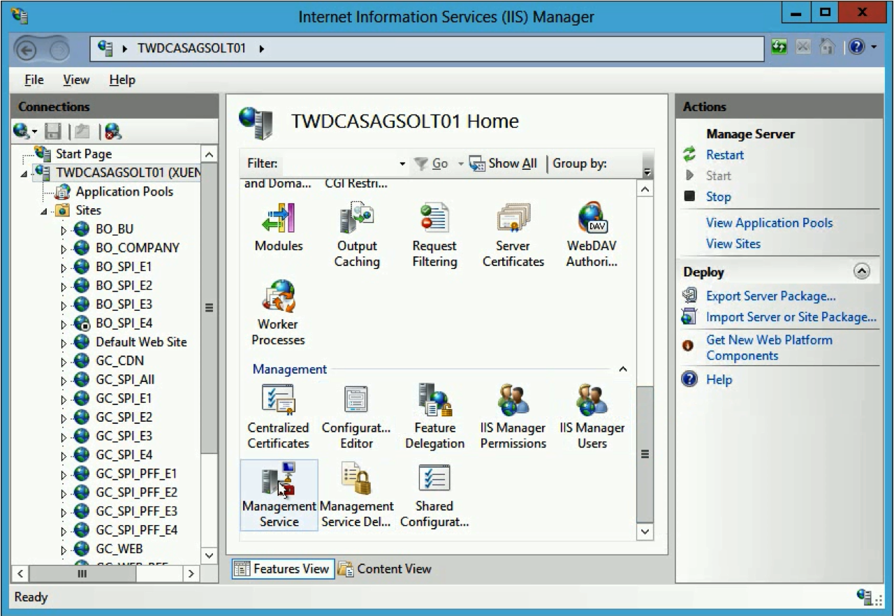

 

確定這邊的 `Enable remote connections` 是勾選的，以及 Port 號正確，若不修改就是走預設的 8172 Port。  

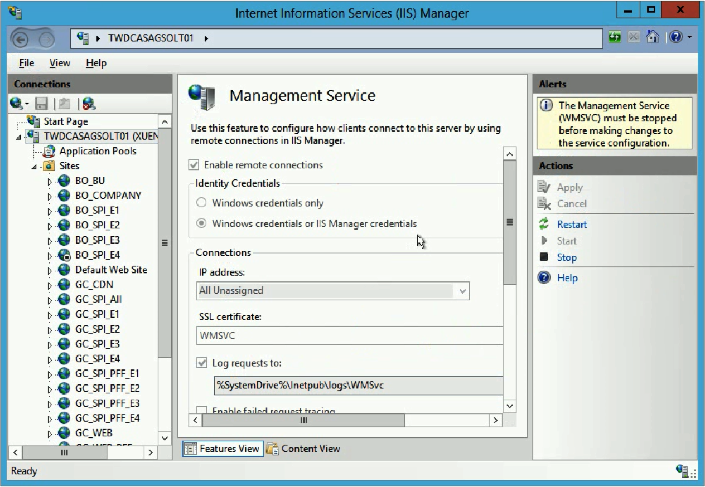

 

如果要使用非 Admin 權限佈署，可以開啟 `IIS Manager Permissions`。  

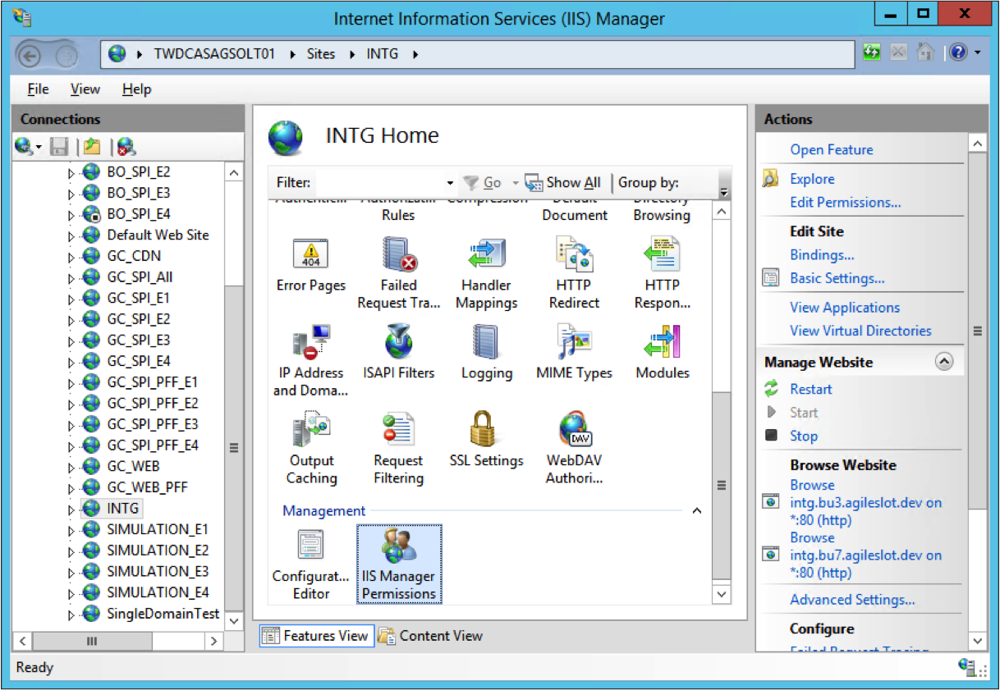

 

新增指定的 User。  

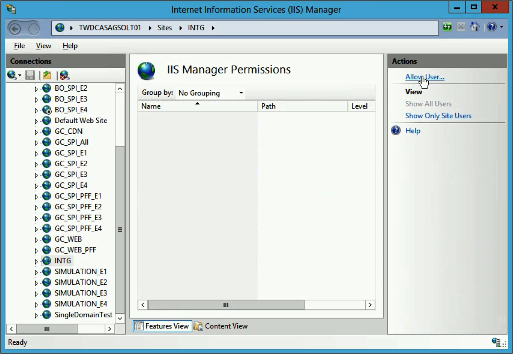

 

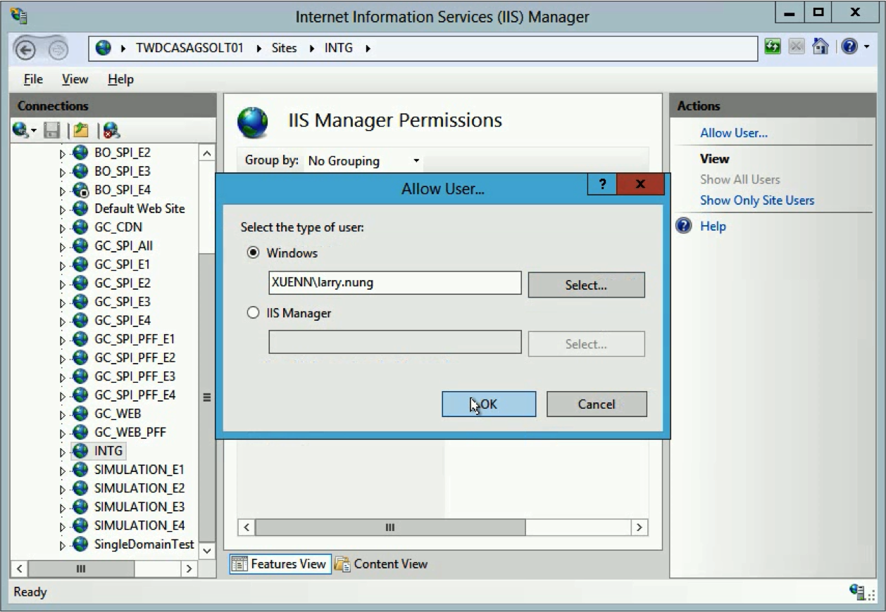

 

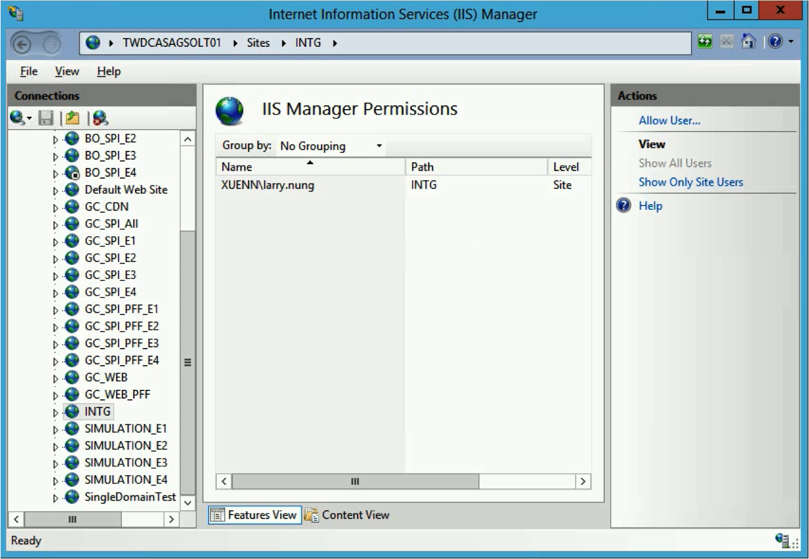

 

Link
----
* [Web Deploy 3.5 : The Official Microsoft IIS Site](https://www.iis.net/downloads/microsoft/web-deploy)
