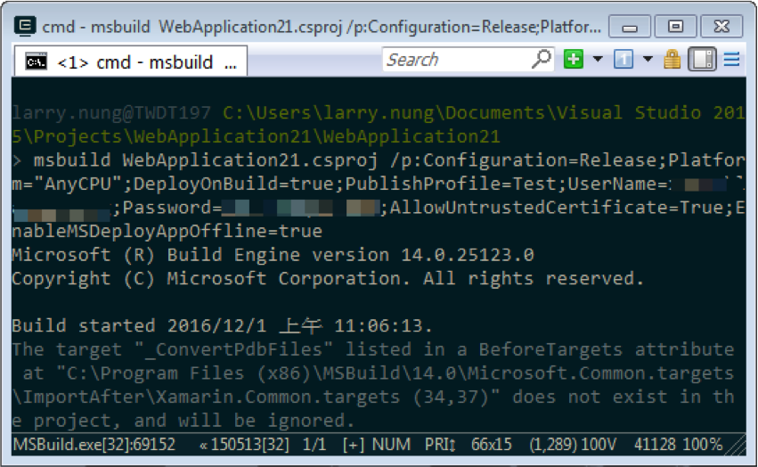

要使用 MsBuild 建置專案並佈署，可以在 MsBuild 建置時帶上 DeployOnBuild 參數告知 MsBuild 在建置完要做佈署，並帶上 PublishProfile 參數指定要使用的 Publish Profile。

msbuild
/p:Configuration=;
Platform="";
DeployOnBuild=true;
PublishProfile=

若有需要可加帶 UserName 參數指定帳號，加帶 Password 參數指定密碼。

msbuild
/p:Configuration=;
Platform="";
DeployOnBuild=true;
PublishProfile=;
UserName=;
Password=

或是加帶其他參數，像是加帶 EnableMSDeployAppOffline 參數使用 AppOffline rule 做佈署，讓 Web deploy 在做發佈的同時幫你放上 App_Offline 頁面。

msbuild
/p:Configuration=;
Platform="";
DeployOnBuild=true;
PublishProfile=;
UserName=;
Password=;
AllowUntrustedCertificate=True;
EnableMSDeployAppOffline=true

