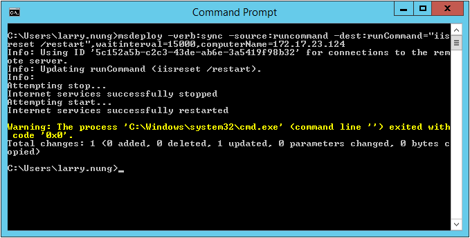

如要使用 Web Deploy 重啟遠端 IIS，可以指定 Web Deploy 使用 sync 操作，source 使用 runcommand，dest 使用 runcommand，並帶入要運行的遠端命令（以這邊來說就是用 iisreset /restart 去重啟 IIS 的命令），及用 computerName provider setting 指定遠端電腦的位置。  

<!-- More -->

    msdeploy -verb:sync -source:runcommand -dest:runCommand="iisreset /restart",waitinterval=15000,computerName=<DestServer>

 

 
