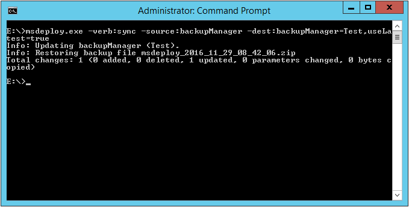

如要使用 Web Deploy 還原本地站台至最後的備份，可以指定 Web Deploy 使用 sync 操作，source 使用 backupManager，dest 使用 backupManager，指定要還原的站台，並用 useLatest = true 指定使用最後一次備份。  

<!-- More -->

    msdeploy.exe -verb:sync -source:backupManager -dest:backupManager=<siteName>,useLatest=true

 

 
