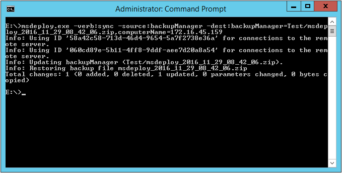

如要使用 Web Deploy 還原遠端站台至指定備份，可以指定 Web Deploy 使用 sync 操作，source 使用 backupManager，dest 使用 backupManager，並指定要還原的站台以及要用來還原的備份檔，及用 computerName provider setting 指定遠端電腦的位置。  

<!-- More -->

    msdeploy.exe -verb:sync -source:backupManager -dest:backupManager=<DestSite>/<BackupFile>, computerName=<DestServer>

 

 
