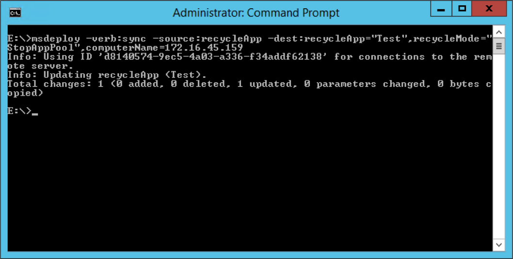
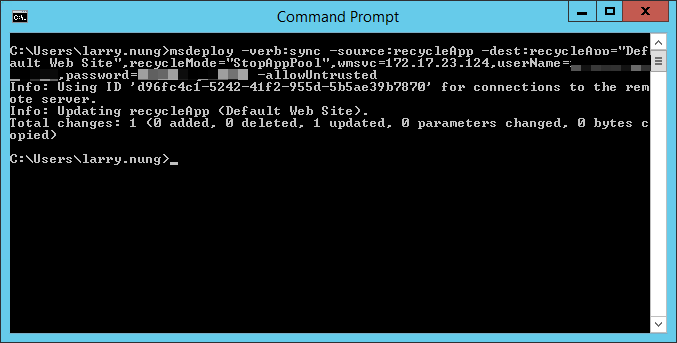

如要使用 Web Deploy 停止遠端 Application，可以指定 Web Deploy 使用 sync 操作，source 使用 recycleApp，dest 使用 recycleApp，並帶入要回收的 Application，指定 recylceMode 為 StopAppPool。

透過 Remote Agent Service 去做遠端電腦連線的話，dest 這邊要使用 computerName provider setting 去指定遠端電腦的位置。

msdeploy -verb:sync -source:recycleApp -dest:recycleApp="",recycleMode="StopAppPool" , computerName=

如果要透過 Web Management Service 去做遠端電腦連線的話，則 dest 這邊要使用 wmsvc provider setting 去指定遠端電腦的位置。

msdeploy -verb:sync -source:recycleApp -dest:recycleApp="",recycleMode="StopAppPool",wmsvc=,userName=,password= -allowUntrusted

