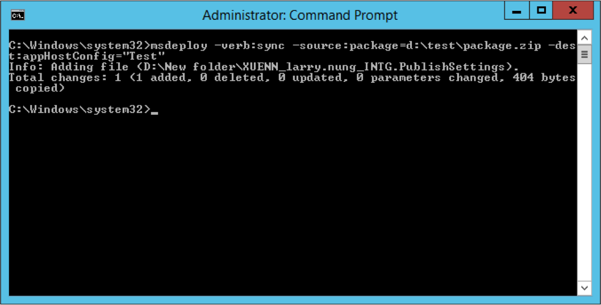

如要使用 Web Deploy 將 Web Deploy Package 佈署到本地站台，可以指定 Web Deploy 使用 sync 操作，source 使用 package provider，帶入 Web Deploy Package 的檔案位置，dest 這邊使用 appHostConfig，指定要佈署的本地站台即可。   

<!-- More -->

    msdeploy -verb:sync -source:package=<Package> -dest:appHostConfig="<DestSite>"

 

 
