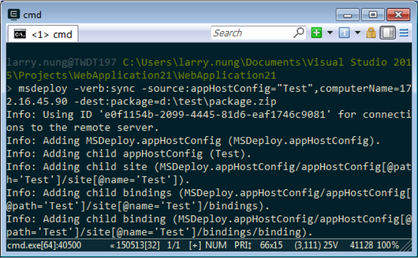

要用 Web Deploy 將遠端站台打包成 Web Deploy Package，可以指定 Web Deploy 使用 sync 操作，source 使用 appHostConfig provider，帶入要打包的站台名稱，及用 computerName provider setting 指定遠端電腦的位置，dest 使用 package provider，指定打包後的 Web Deploy Package 位置即可。

msdeploy -verb:sync -source:appHostConfig="",computerName= -dest: package=

