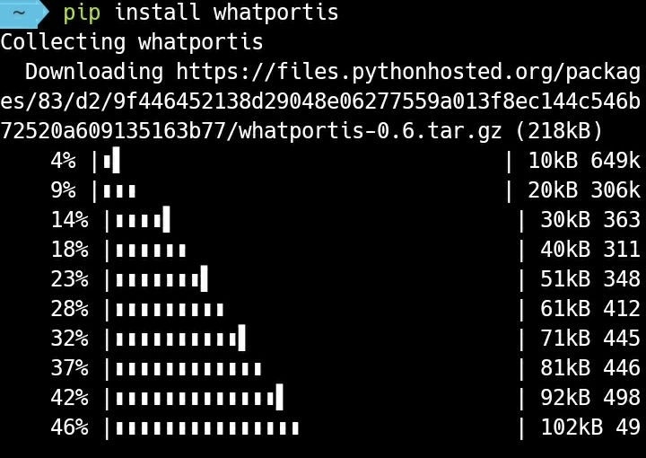
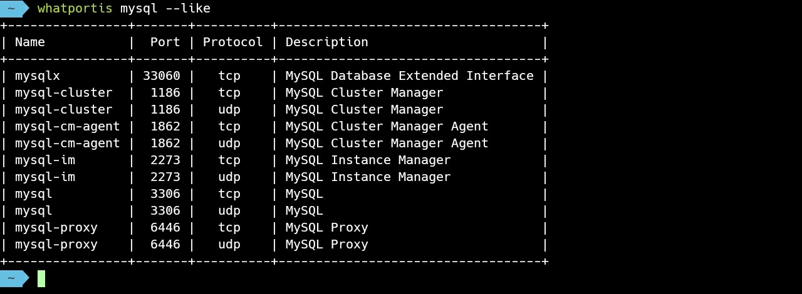

Whatportis 能夠查詢特定服務預設使用的通訊埠，或是特定的通訊埠通常被哪些服務使用。  

<!-- more -->

 

程式可透過 pip 安裝。  

    pip install whatportis

 

要查詢特定服務預設使用的通訊埠，可直接帶入服務名稱查詢。  

    whatportis <Service>

 

要查詢特定通訊埠通常被哪些服務使用，可直接帶入通訊埠號查詢。  

    whatportis <Service>

 

若要模糊查詢可加上參數 --like。  

    whatportis <Service> --like

 

也可以帶上參數 --json 將結果改成 JSON 輸出。  

    whatportis <Service|Port> --json

 

whatportis 也可以做為 RESTful API server 使用。  

    whatportis --server <Domain> <Port>

 

支援的 API 如下:  

    http://<Domain>:<Port>/ports
    http://<Domain>:<Port>/ports/<Service>
    http://<Domain>:<Port>/ports/<<Port>
    http://<Domain>:<Port>/ports/<Service>?like

使用上會像下面這樣:  

