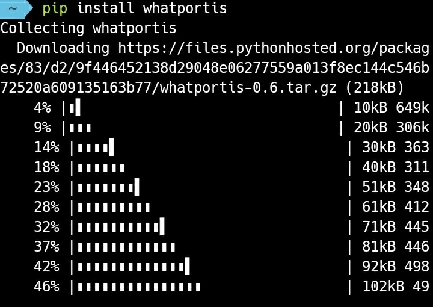
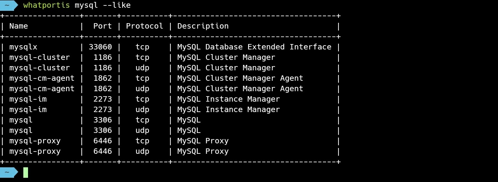

Whatportis 能夠查詢特定服務預設使用的通訊埠，或是特定的通訊埠通常被哪些服務使用。

程式可透過 pip 安裝。

pip install whatportis

要查詢特定服務預設使用的通訊埠，可直接帶入服務名稱查詢。

whatportis

要查詢特定通訊埠通常被哪些服務使用，可直接帶入通訊埠號查詢。

whatportis

若要模糊查詢可加上參數 --like。

whatportis  --like

也可以帶上參數 --json 將結果改成 JSON 輸出。

whatportis  --json

whatportis 也可以做為 RESTful API server 使用。

whatportis --server

支援的 API 如下:

http://:/ports
http://:/ports/
http://:/ports/
http://:/ports/?like

使用上會像下面這樣:

