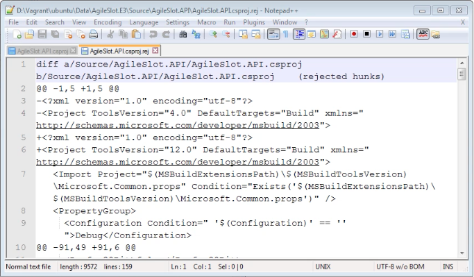
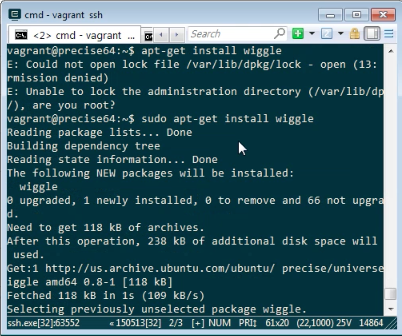
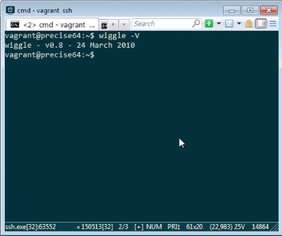
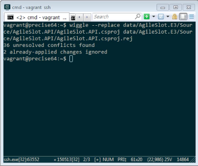
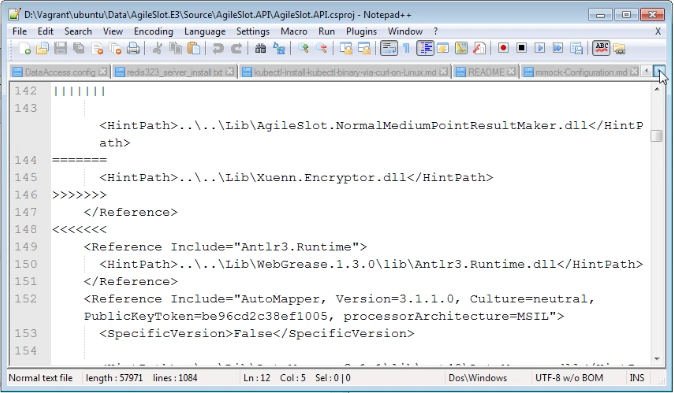

使用 Git 套用 patch 若發生衝突，我們可能會用下列命令讓 Git 盡可能的幫我們套用能被套用的變更。  

<!-- More -->

    git apply --reject [PatchFile]

 

套用不了的部分會被放到 rej 檔內。  

 

rej 檔的內容會存放某個檔案某個位置的變動，若要進行衝突的修正，需要將本來的檔案與 rej 檔交互比對，十分的不方便。  

 

wiggle 工具能幫我們將 rej 檔與本來的程式合併，便於後續衝突的修正。  

 

wiggle 可透過 apt-get 安裝。  

    apt-get install wiggle

 

安裝完可查閱一下版本，簡單的測試一下安裝成功與否。  

    wiggle -v

 

安裝無誤即可使用 wiggle --replace 將 rej 檔與本來的程式合併。   

    wiggle --replace [OriginalFile] [RejFile]

 

合併後的檔案會像下面這樣，比起開啟兩個檔案交互比對，這樣合併後衝突會變得比較好處理些。  

 

Link
----
* [Ubuntu Manpage: wiggle - apply rejected patches and perform word-wise diffs](http://manpages.ubuntu.com/manpages/zesty/man1/wiggle.1.html)
* [[ Aknow::Work ]: 打 patch 時遇到 conflict 怎麼辦](http://aknow-work.blogspot.tw/2013/08/patch-conflict.html)
