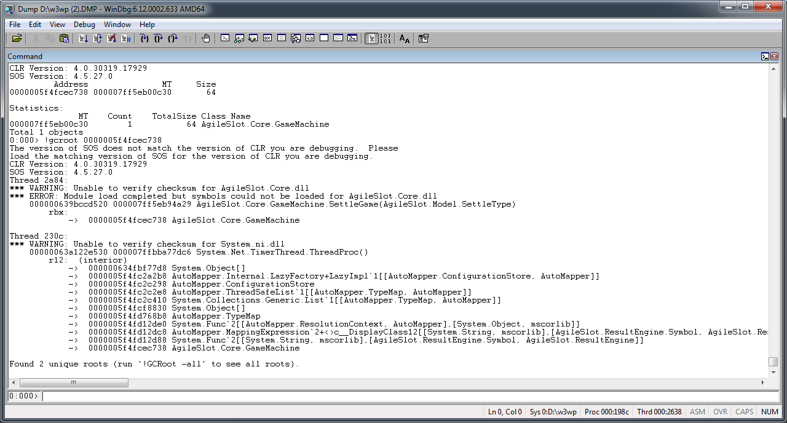

如果檢查出該被回收的物件並為如預期的被回收，這邊可以看一下物件的 gcroot，看看物件是為何被佔住而不能釋放。  

<!-- More -->

 

像是這邊如果用 `!dumpheap –stat` 查看發現 `7ff5e8859b0` MT 位置的物件有問題，這邊可以調用命令 `!dumpheap -mt 7ff5e8859b0`，查看其對應到的 Address。  

    0:000> !dumpheap -mt 7ff5e8859b0
    The version of SOS does not match the version of CLR you are debugging. Please
    load the matching version of SOS for the version of CLR you are debugging.
    CLR Version: 4.0.30319.17929
    SOS Version: 4.5.27.0
    Address MT Size
    000000865eca7860 000007ff5e8859b0 120
    
    Statistics:
    MT Count TotalSize Class Name
    000007ff5e8859b0 1 120 AgileSlot.Core.GameMachine
    Total 1 objects
    Fragmented blocks larger than 0.5 MB:
    Addr Size Followed by
    000000865eddd990 0.5MB 000000865ee5ea78 System.String
    000000875ec1d828 4.7MB 000000875f0dd828 System.Threading.Overlapped

 

這邊可以看到 Address 為 `000000865eca7860`，所以調用命令 `!gcroot 865eca7860` 下去查看。  
	
	0:000> !gcroot 865eca7860
    The version of SOS does not match the version of CLR you are debugging. Please
    load the matching version of SOS for the version of CLR you are debugging.
    CLR Version: 4.0.30319.17929
    SOS Version: 4.5.27.0
    HandleTable:
    000000855e8d15e0 (pinned handle)
    -> 000000895ea93758 System.Object[]
    -> 000000865eca7918 AutoMapper.Internal.LazyFactory+LazyImpl`1[[AutoMapper.ConfigurationStore, AutoMapper]]
    -> 000000865eca9250 AutoMapper.ConfigurationStore
    -> 000000865eca92a0 AutoMapper.ThreadSafeList`1[[AutoMapper.TypeMap, AutoMapper]]
    -> 000000865eca9358 System.Collections.Generic.List`1[[AutoMapper.TypeMap, AutoMapper]]
    -> 000000865ed15bb8 System.Object[]
    -> 000000865ed16570 AutoMapper.TypeMap
    -> 000000865ed17310 System.Func`2[[AutoMapper.ResolutionContext, AutoMapper],[System.Object, mscorlib]]
    -> 000000865ed172f8 AutoMapper.MappingExpression`2+<>c__DisplayClass12[[System.String, mscorlib],[AgileSlot.GameEngine.Symbol, AgileSlot.GameEngine]]
    -> 000000865ed172b8 System.Func`2[[System.String, mscorlib],[AgileSlot.GameEngine.Symbol, AgileSlot.GameEngine]]
    -> 000000865eca7860 AgileSlot.Core.GameMachine
    
    Found 1 unique roots (run '!GCRoot -all' to see all roots).

	

 

像是筆者這邊的例子就是因為 AutoMapper 的 Mapping 寫法造成物件無法如預期釋放。  
