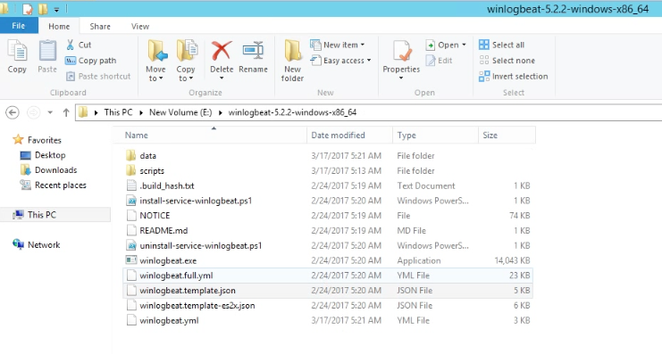
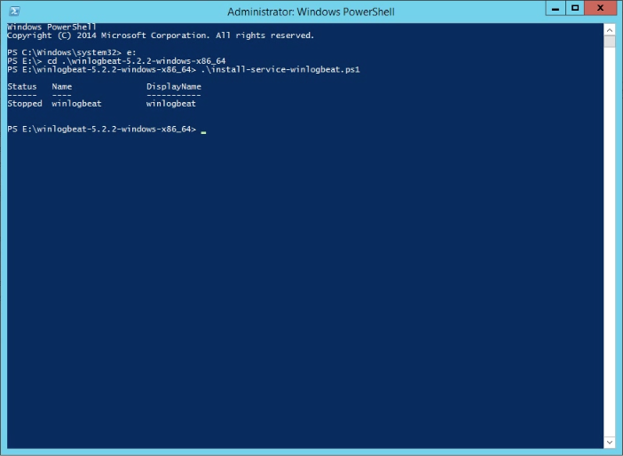
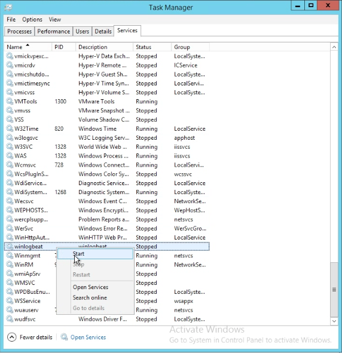
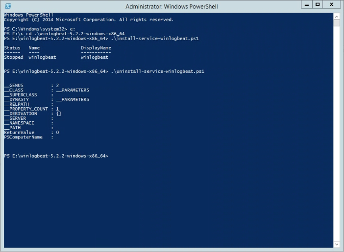

要在 Windows 下使用 Winlogbeat，可先至官網下載下來解壓縮。

<!-- More -->

 

裡面比較會要用到的檔案有 winlogbeat.exe、install-service-winlogbeat.psl、uninstall-service-winlogbeat.psl 與 winlogbeat.yml。

 

winlogbeat.yml 是 Winlogbeat 的設定檔，設定完後直接點擊 winlogbeat.exe 就會開始作用。

 

也可以執行 install-service-winlogbeat.psl 註冊成 Windows 服務，讓 Winlogbeat 在背景服務。

 

Windows 服務註冊完後記得將服務啟動才有效果。

 

做到這邊 Winlogbeat 就能依照設定正常的傳送 Windows Event Logs。

 

若有需要後續也可執行 uninstall-service-winlogbeat.psl 將 Winlogbeat 的 Windows 服務移除。

 

Link
----
* [Download Winlogbeat • Ship Windows Event Logs | Elastic](https://www.elastic.co/downloads/beats/winlogbeat)
