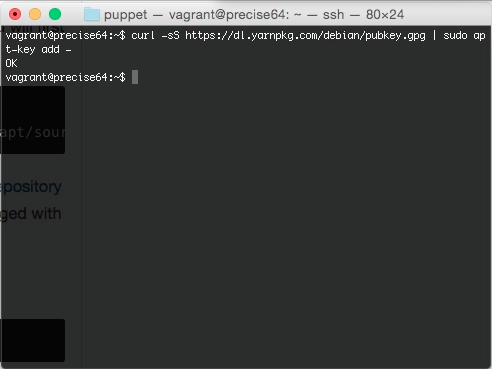
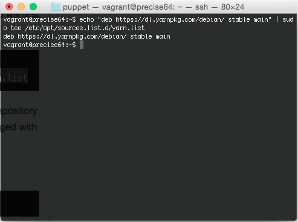
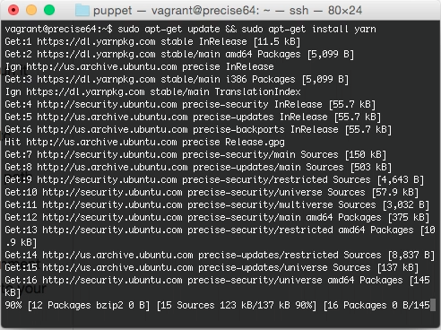

要透過 APT 安裝 Yarn，需要先設定 Repository。

curl -sS https://dl.yarnpkg.com/debian/pubkey.gpg | sudo apt-key add -

echo "deb https://dl.yarnpkg.com/debian/ stable main" | sudo tee /etc/apt/sources.list.d/yarn.list

Repository 設定完後，更新 apt-get，更新完即可進行 Yarn 的安裝。

sudo apt-get update && sudo apt-get install yarn

Link
----
* [Installation | Yarn](https://yarnpkg.com/en/docs/install#linux-tab)