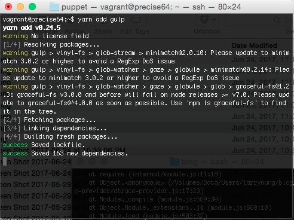
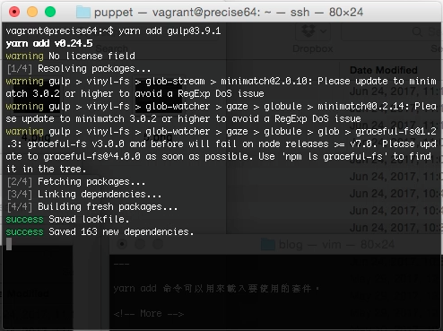
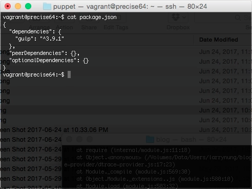
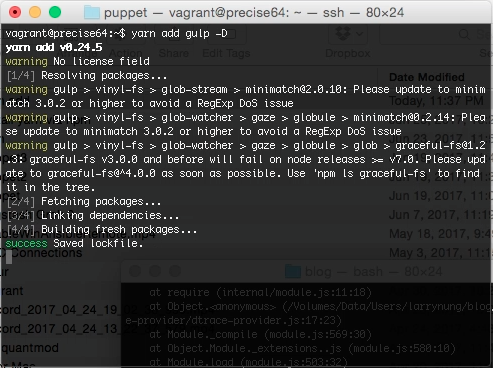
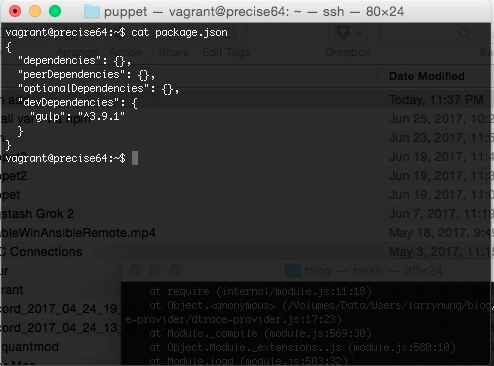
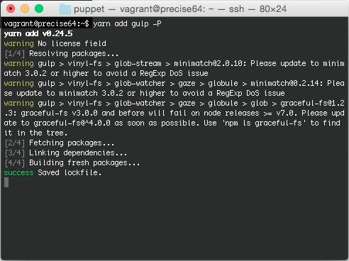
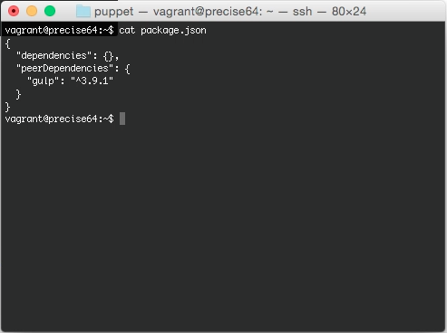
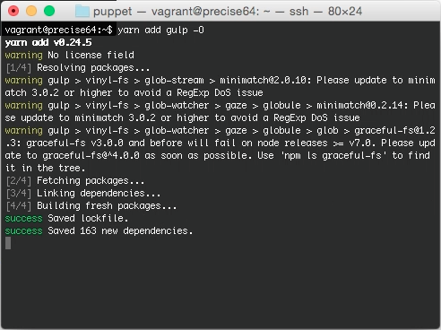
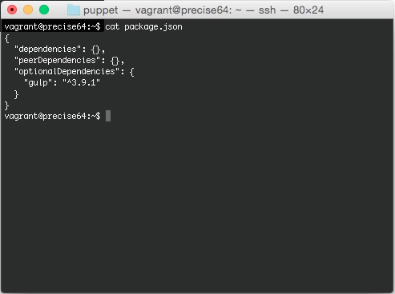

yarn add 命令可以用來載入要使用的套件。

調用 yarn add，帶入套件名稱，即可將指定的套件載入。

yarn add

若要指定版本，可在套件名稱後面加上套件的版本號。

yarn add @

套件載入的同時會寫入 package.json 的 dependencies。

如果要將套件載入的同時寫入 package.json 的 devDependencies，可帶入參數 --dev 或是 -D。

yarn add  --dev
yarn add  -D

要在套件載入的同時寫入 package.json 的 peerDependencies，可帶入參數 --peer 或 -P。

yarn add  --peer
yarn add  -P

要在套件載入的同時寫入 package.json 的 optionalDependencies，可帶入參數 --optional 或 -O。

yarn add  --optional
yarn add  -O

Link
----
* [yarn add | Yarn](https://yarnpkg.com/en/docs/cli/add)