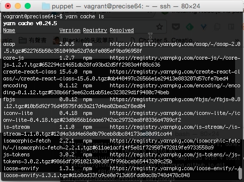
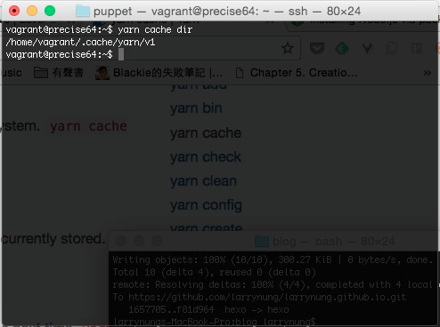
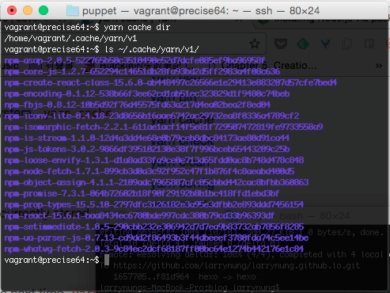
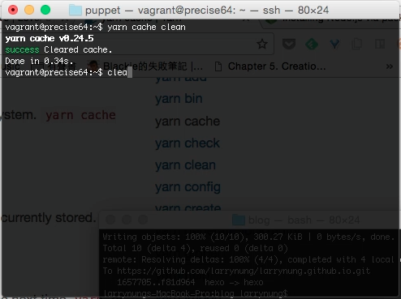
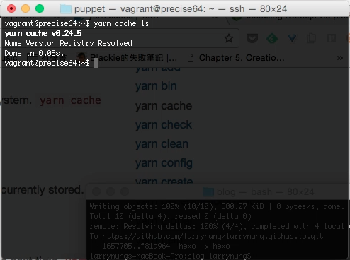
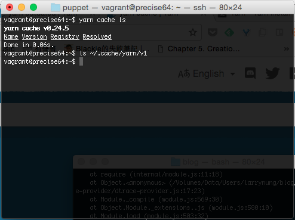

yarn cache 命令可以針對 yarn 的快取做些相關的控制。  

<!-- More -->

 

像是調用 yarn cache ls 可查閱現在有備快取的套件。  

 

yarn cache dir 可查閱套件快取的位置。  

 

yarn 快取的套件都會存放在設定的套件快取位置下。  

 

yarn cache clean 命令可以清除 yarn 的快取。  

 

清除完用 yarn cache ls 查看就會看到快取已被清除。  

 

設定的套件快取位置下所快取的檔案也會一併移除。  

 
