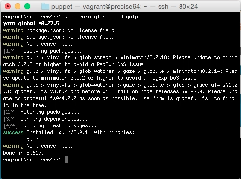
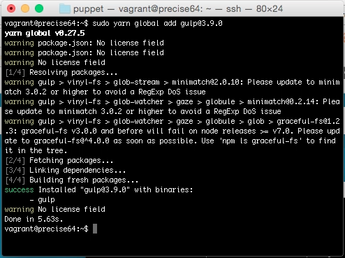
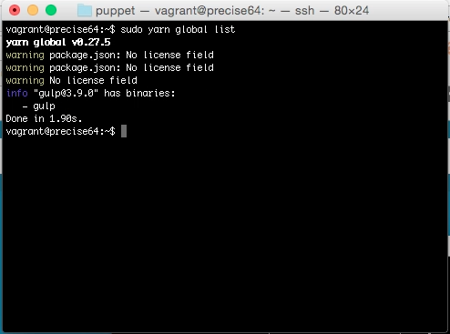
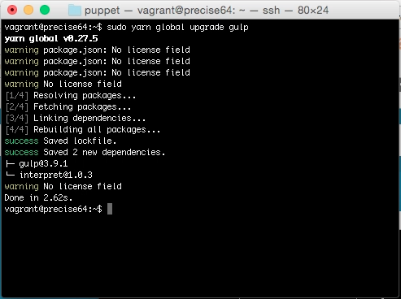
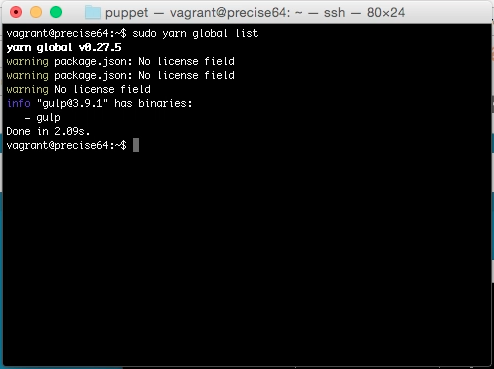
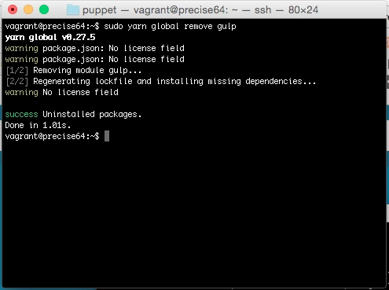
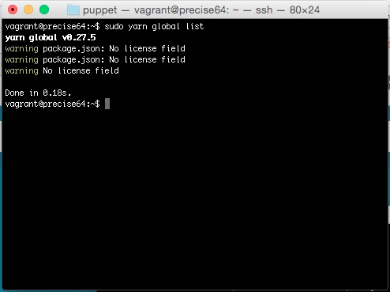

Yarn global 命令可用來進行全域套件的管理。  

<!-- More -->

 

像是可以使用 Yarn global add 將套件安裝到全域。  

    yarn global add <PackageName>

 

或是在套件名稱後用小老鼠串接套件的版本，指定安裝指定的套件版本。  

    yarn global add <PackageName>@<PackageVersion>

 

安裝完可用 Yarn global list 查閱安裝的套件。  

    yarn global list

 

若要更新全域套件，可使用 yarn global upgrade，帶上要更新的套件名稱即可。  

    yarn global upgrade <PackageName>

 

 

若要移除全域套件，可使用 yarn global remove，後面帶上要移除的套件。  

    yarn global remove <PackageName>

 

 

Link
----
* [yarn global | Yarn](https://yarnpkg.com/en/docs/cli/global)
