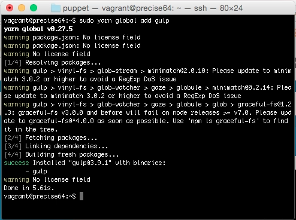
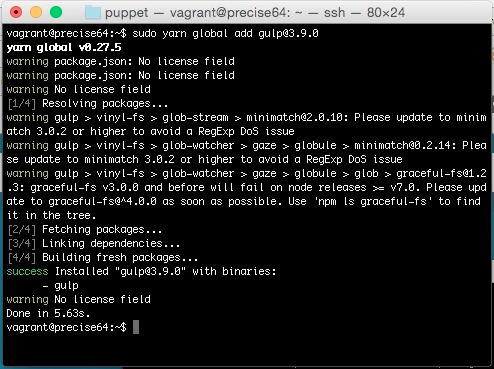
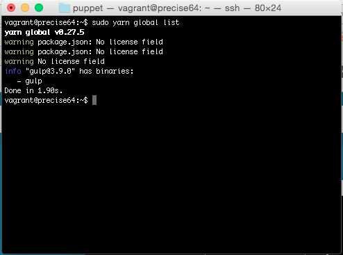
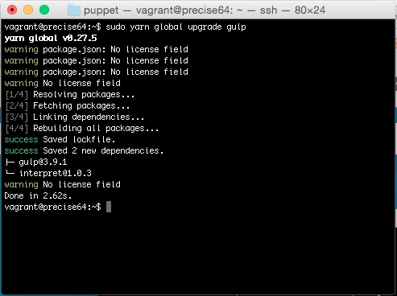
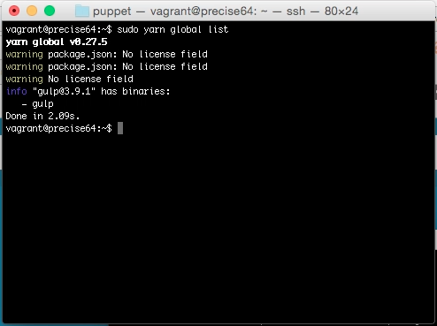
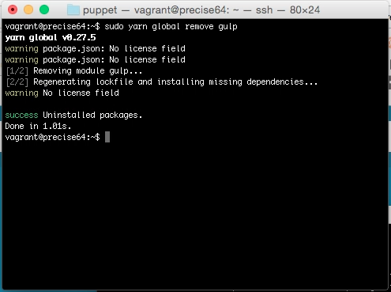
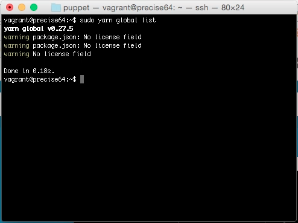

Yarn global 命令可用來進行全域套件的管理。

像是可以使用 Yarn global add 將套件安裝到全域。

yarn global add

或是在套件名稱後用小老鼠串接套件的版本，指定安裝指定的套件版本。

yarn global add @

安裝完可用 Yarn global list 查閱安裝的套件。

yarn global list

若要更新全域套件，可使用 yarn global upgrade，帶上要更新的套件名稱即可。

yarn global upgrade

若要移除全域套件，可使用 yarn global remove，後面帶上要移除的套件。

yarn global remove

Link
----
* [yarn global | Yarn](https://yarnpkg.com/en/docs/cli/global)