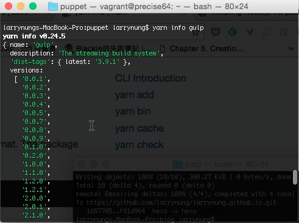
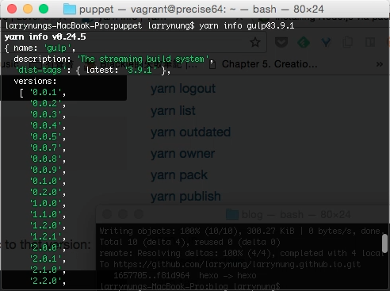
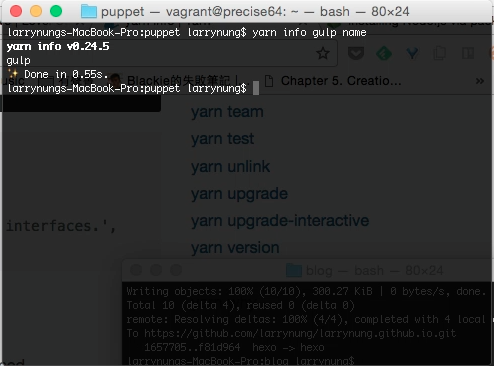
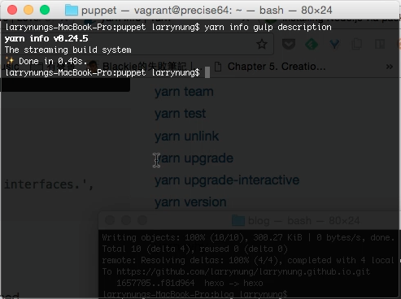
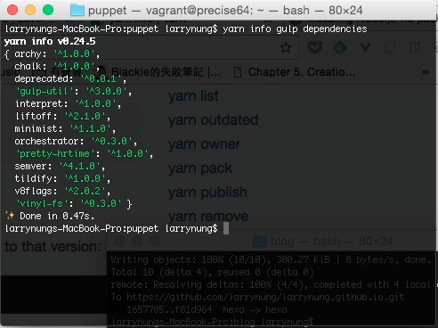
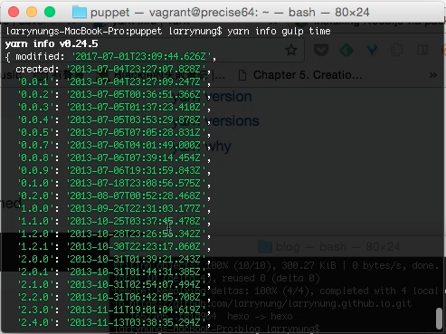
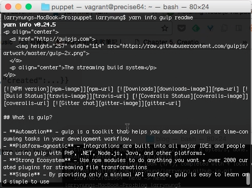
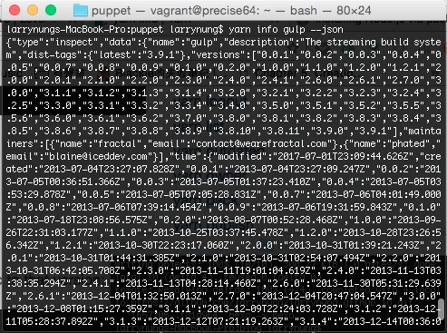

Yarn info 命令可用來查閱套件的資訊。  

<!-- More -->

 

可以直接用 yarn info 帶上指定的套件名稱查閱指定套件的資訊。  

    yarn info <PackageName>

 

若要查閱指定版本的套件資訊，也可以在套件名稱後面用小老鼠加帶套件版本。  

    yarn info <PackageName>@<PackageVersion>

 

要查閱指定的套件資訊的話，可以再多帶上套件資訊的名稱。

    yarn info <PackageName> <InfoName>

 

像是可以查閱套件的名稱。  

    yarn info <PackageName> name

 

查閱套件的描述。  

    yarn info <PackageName> description

 

查閱套件的依賴。  

    yarn info <PackageName> dependencies

 

查閱套件的建立與修改時間。  

    yarn info <PackageName> time

 

查閱套件的說明文件。  

    yarn info <PackageName> readme

 

若是要用程式去擷取套件的資訊，也可以加帶 --json 改用 JSON 格式顯示。  

    yarn info <PackageName> --json

 

Link
----
* pyarn info | Yarn](https://yarnpkg.com/en/docs/cli/info)
