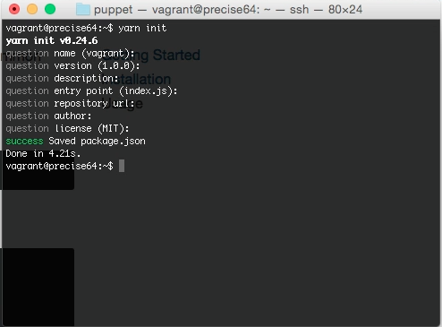
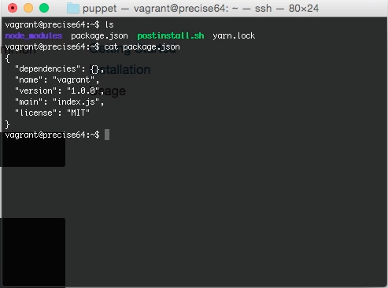
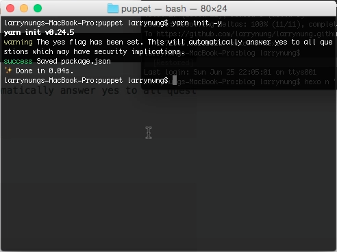
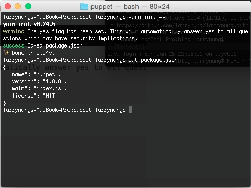

yarn init 命令可以用來建立 package.json 檔案。  

<!-- More -->

 

調用 yarn init，依序填入 package.json 檔需要的資訊。  

 

即可建立 package.json。   

 

如果要直接用預設值建立 package.json，可在調用 yarn init 時帶入 -y 參數。  

    yarn init -y

 

就不用使用互動的方式建立，然後一直按 Enter 套預設值。  

 

Link
----
* [yarn init | Yarn](https://yarnpkg.com/en/docs/cli/init)
