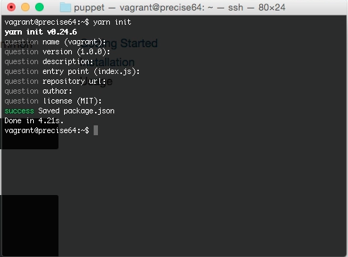
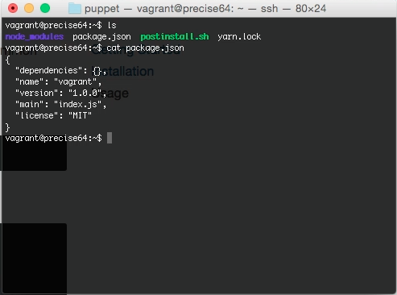
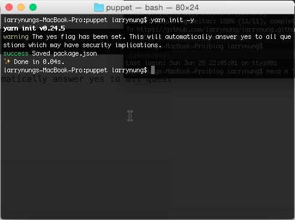
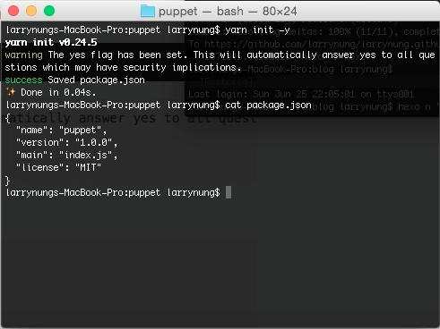

yarn init 命令可以用來建立 package.json 檔案。

調用 yarn init，依序填入 package.json 檔需要的資訊。

即可建立 package.json。

如果要直接用預設值建立 package.json，可在調用 yarn init 時帶入 -y 參數。

yarn init -y

就不用使用互動的方式建立，然後一直按 Enter 套預設值。

Link
----
* [yarn init | Yarn](https://yarnpkg.com/en/docs/cli/init)