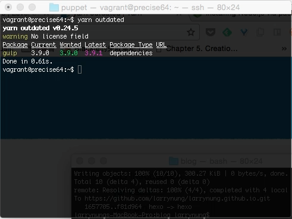
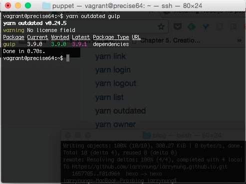

yarn outdated 命令可用來檢查是否有使用到過時的套件。  

<!-- More -->

 

調用命令 yarn outdated 後會列出像下面這樣的資訊，有套件的名稱、目前使用的版本、預期的版本、最新的版本等資訊。  

    yarn outdated

 

若資訊過多也可以在調用時加帶套件的名稱，這樣就會只檢查指定的套件。  

    yarn outdated [package...]

 

Link
----
* [yarn outdated | Yarn](https://yarnpkg.com/en/docs/cli/outdated)
