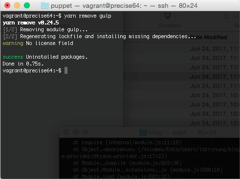
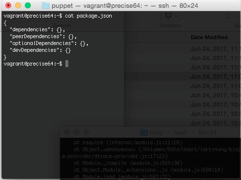

yarn remove 命令可以用來移除載入的套件。  

<!-- More -->

 

若是本來已有載入的套件。  

 

就可以調用 yarn remove 命令，帶入套件名稱，將指定的套件移除。  

    yarn remove <PackageName>

 

 

Link
----
* [yarn remove | Yarn](https://yarnpkg.com/en/docs/cli/remove)
