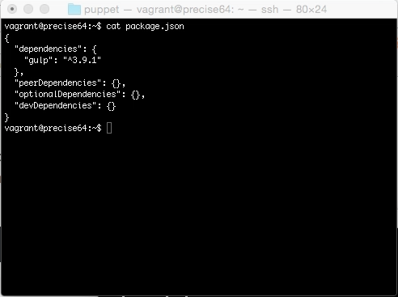
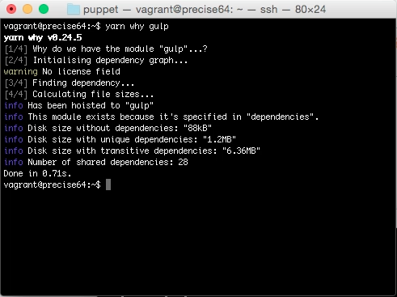
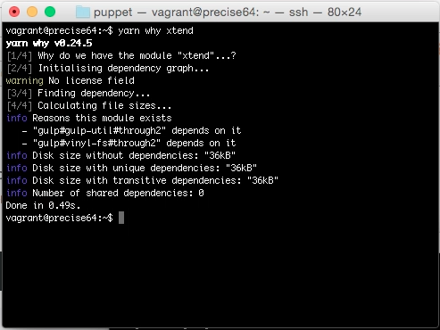

Yarn why 命令可用來查閱套件安裝的原因。

使用上只要用 yarn why 帶上套件的名稱即可。

yarn why

像是這邊安裝了 gulp 套件。

用 yarn why 查驗，就會看到是因為在 dependencies 設定的關係。

如果查驗 gulp 以外的套件，就會看到是因為被 gulp 套件依賴或是間接依賴才會被安裝進去。

Link
----
* [yarn why | Yarn](https://yarnpkg.com/en/docs/cli/why)