要使用 Zapier 去觀察 RSS 的變化自動在 LinkedIn 貼文，可先找到對應的 Zap。  

<!-- More -->

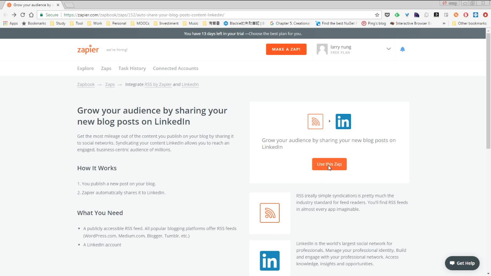

 

設置要連接 RSS。  

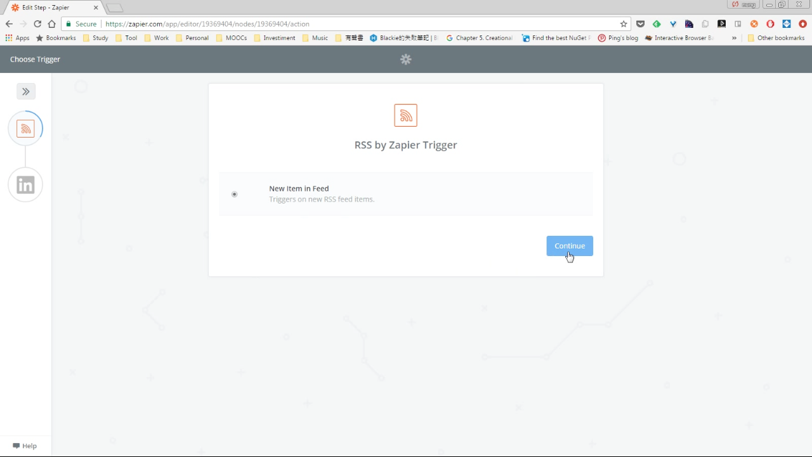

 

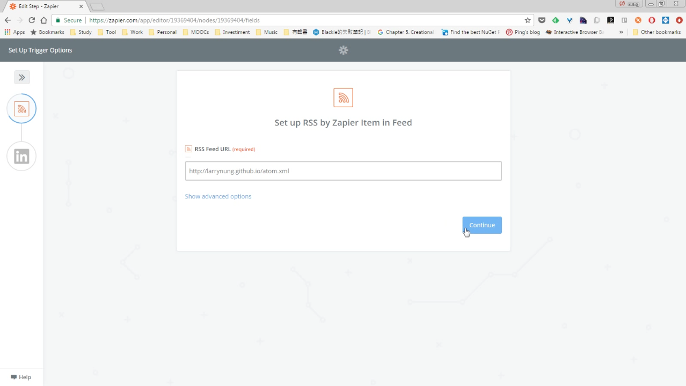

 

按下 'Fetch & Continue' 按鈕測試 RSS 的擷取。  

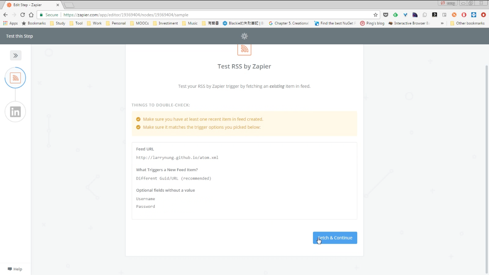

 

測試完成按下 'Continue' 按鈕繼續。  

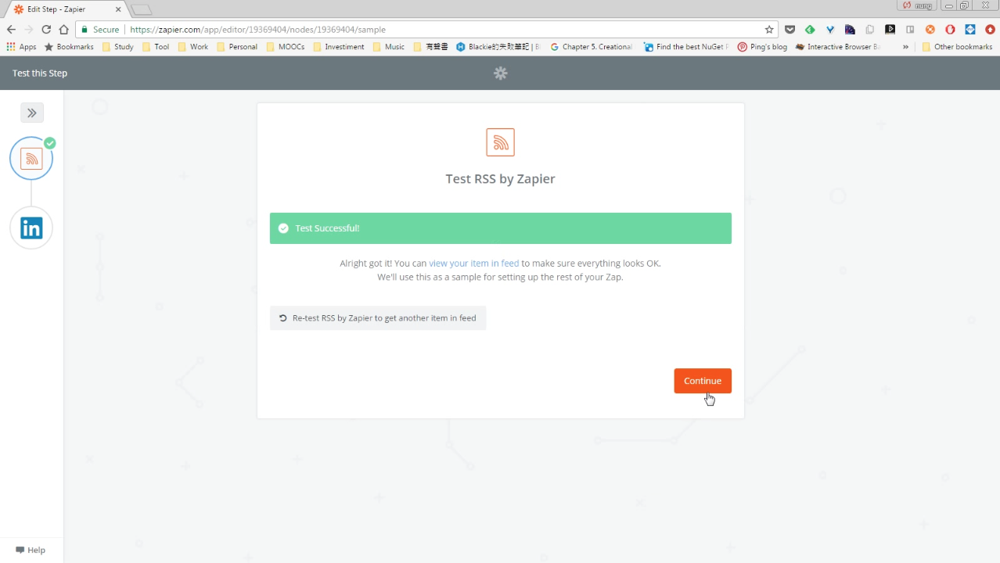

 

RSS 設完接著要設定 LinkedIn。  

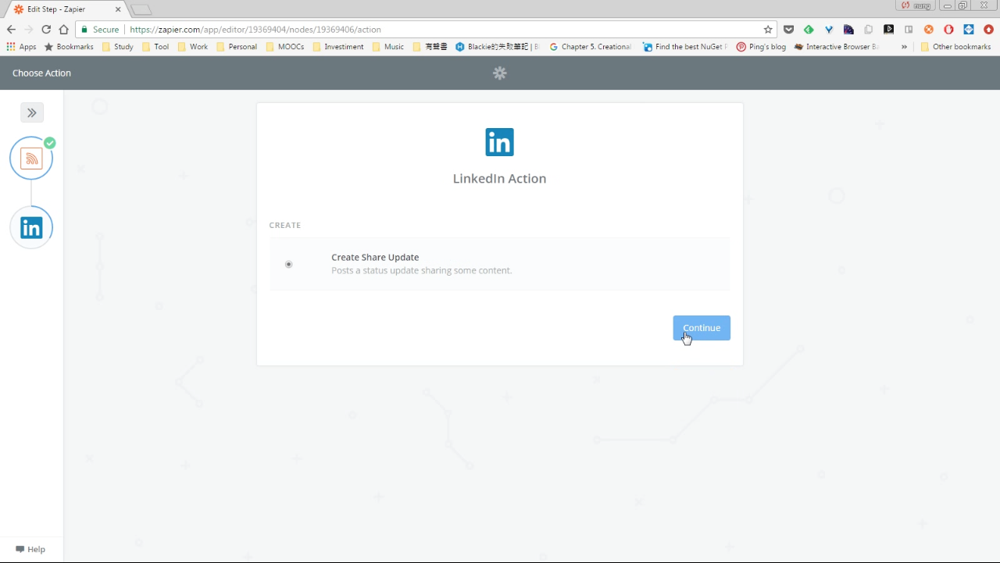

 

按下 'Connect a New Account' 連結 LinkedIn 帳號。  

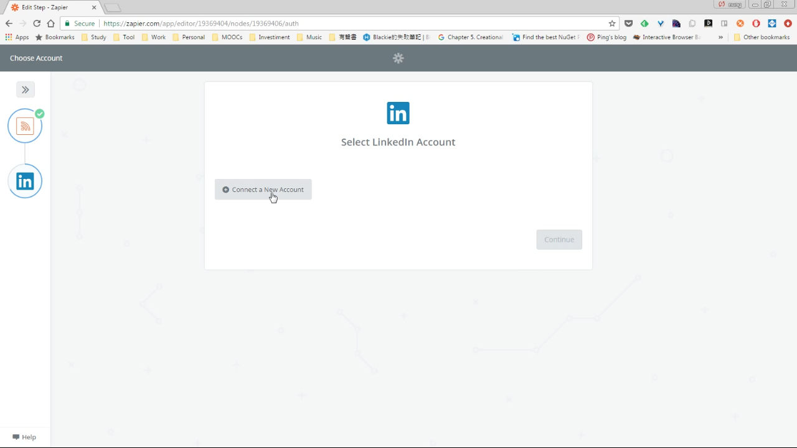

 

授予 Zapier 使用 LinkedIn 的權限。  

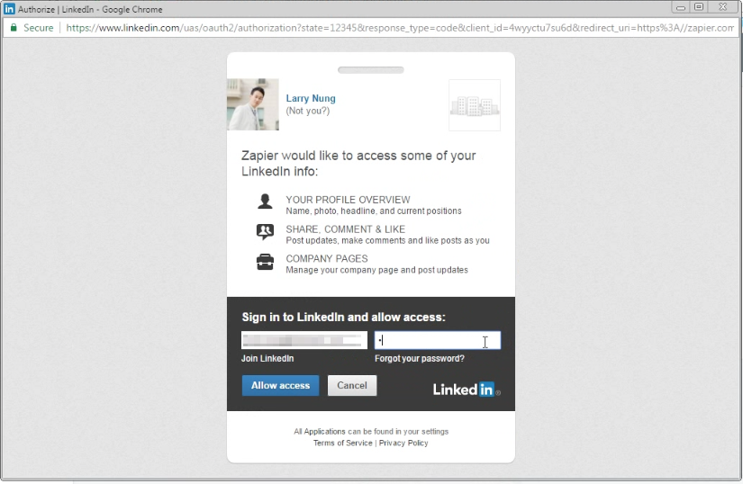

 

回到 Zapier 後按下 'Test' 按鈕測試連結。  

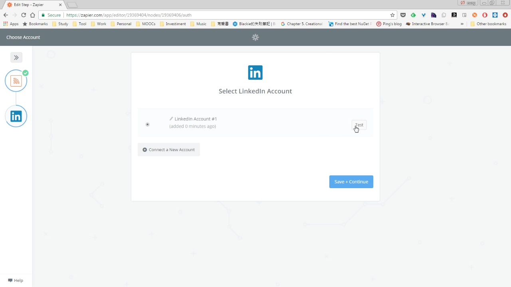

 

連結測試無誤後，按下 'Save + Continue' 按鈕。  

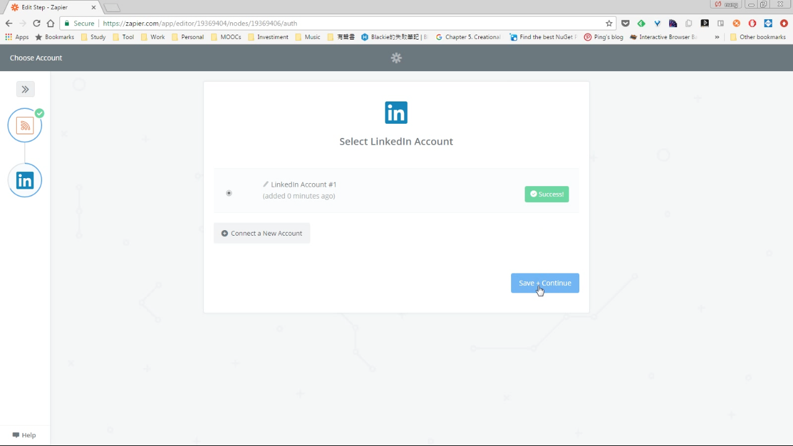

 

再來要設定 LinkedIn 貼文的資訊，像是貼文的訊息格式，預設會使用 RSS 擷取到的 Title 與 Link 當作貼文的內容，若想要用更多資訊去設定貼文，可以按下後方的按鈕加入欲使用的資訊。  

 

如果要設定貼文以外的資訊，可點選 'Show advanced options'。  

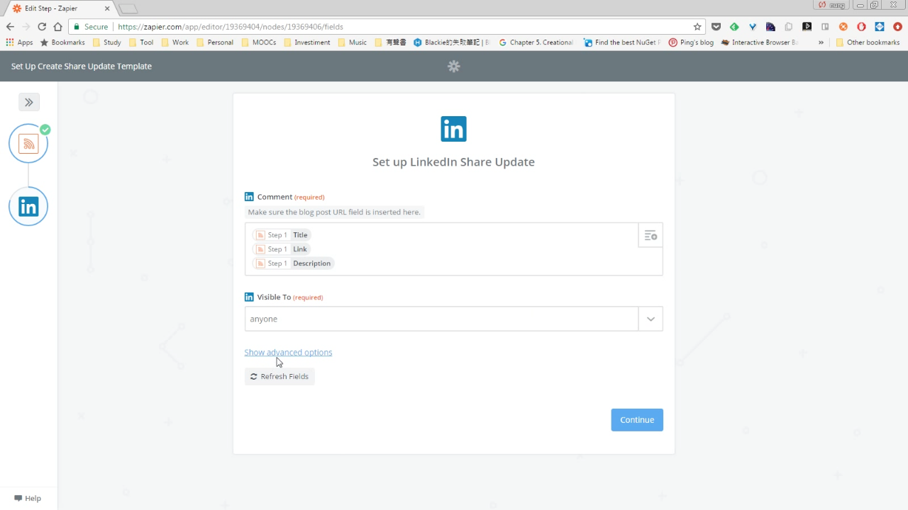

 

設定好後按下 'Continue' 按鈕。  

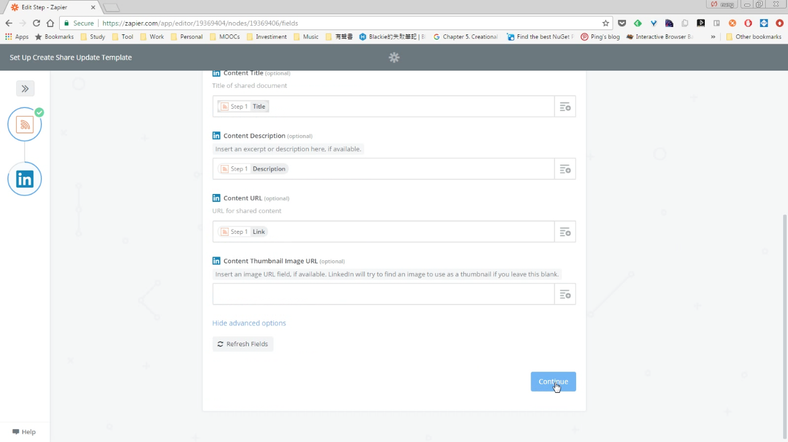

 

接著會詢問是否要做個測試，可點選 'Create & Continue' 按鈕測試由 Zapier 擷取 RSS 並在 LinkedIn 貼文。  

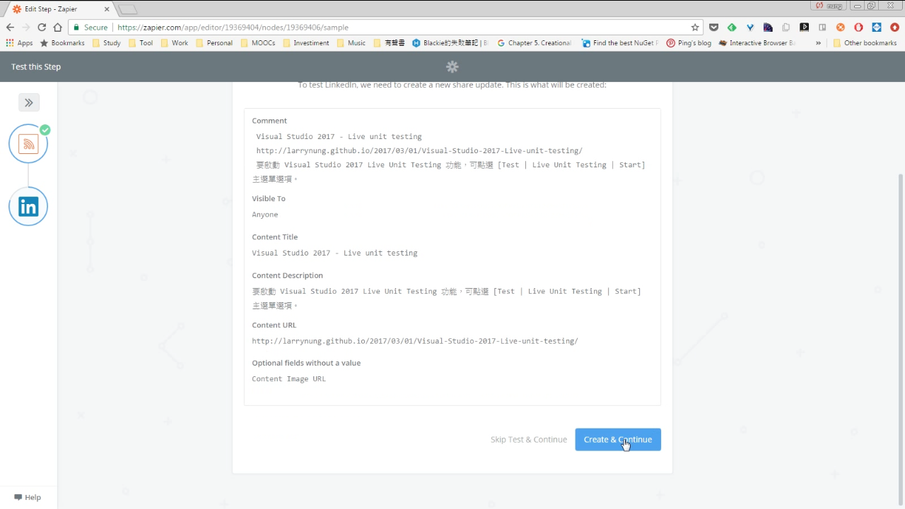

 

測試完成可在 LinkedIn 看到 Zapier 發的貼文。  

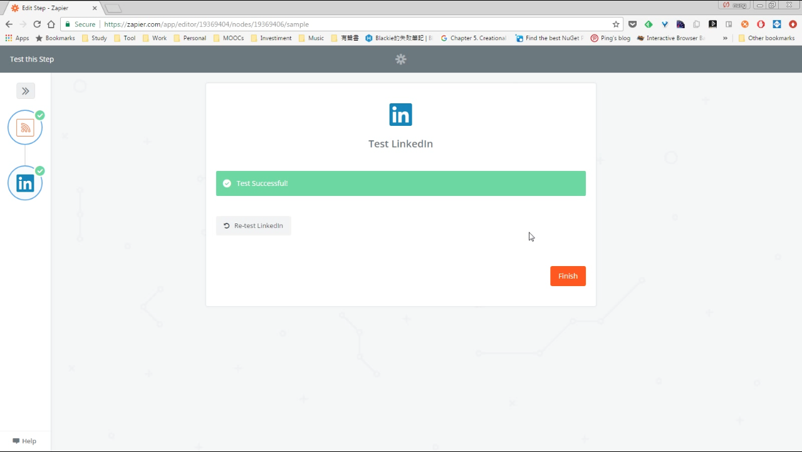

 

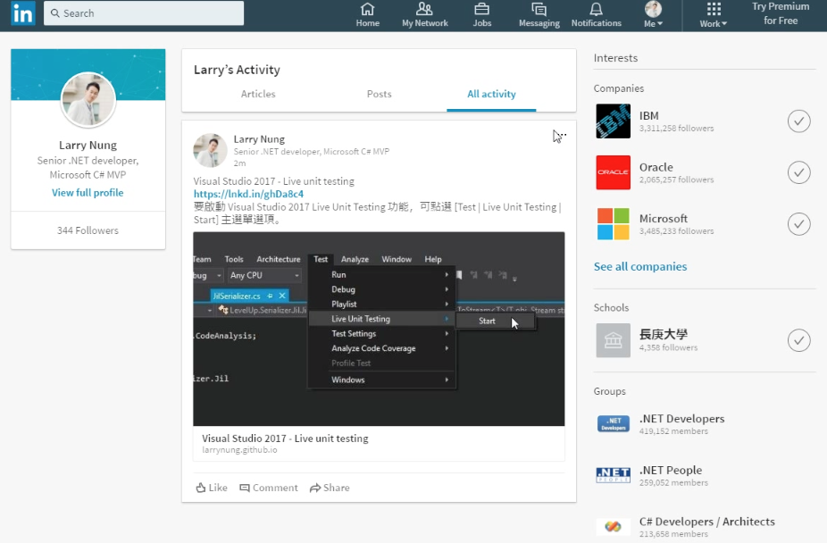

 

最後 Zap 設定完成，確認 Zap 狀態是 ON，則後續 Zapier 就會幫我們把 RSS 的內容同步發到 LinkedIn 上。  

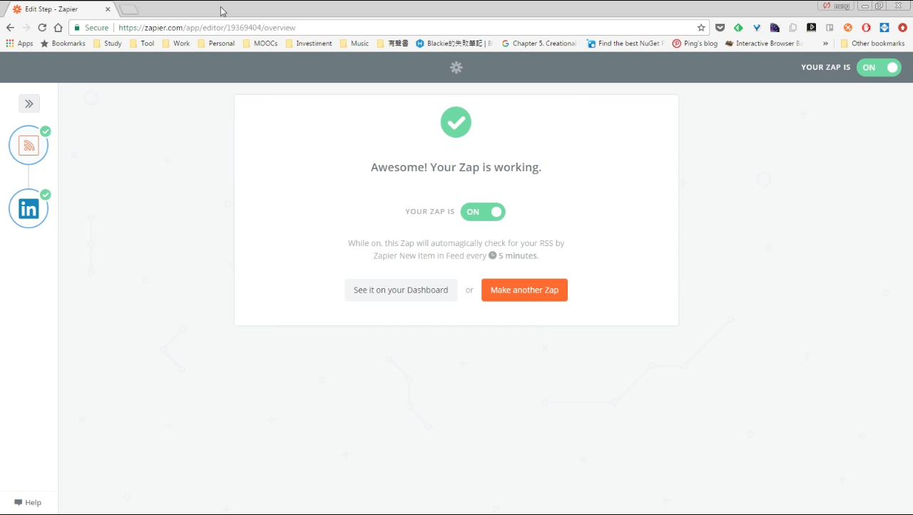

 

Link
