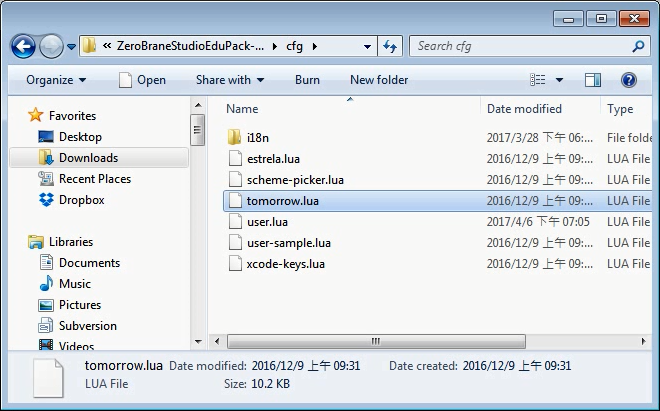
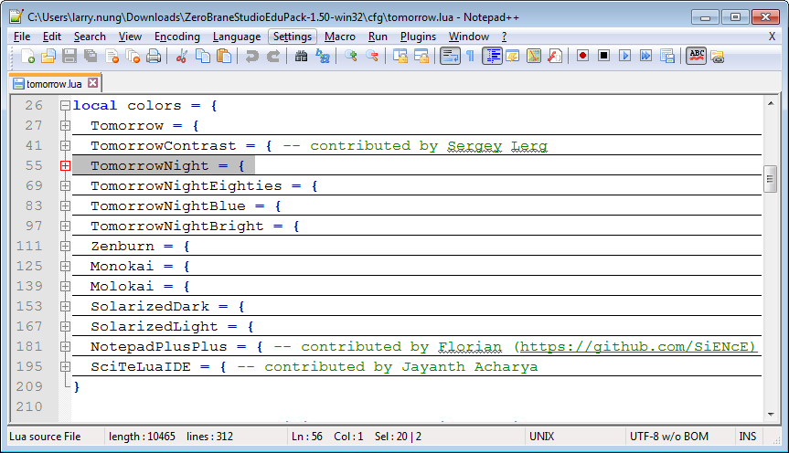
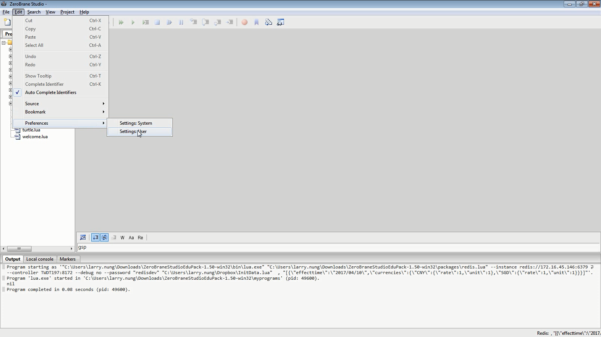
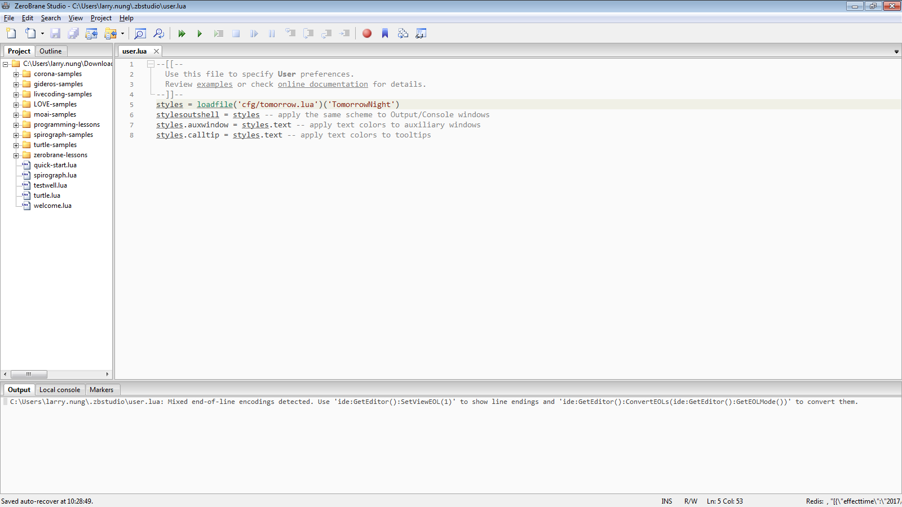
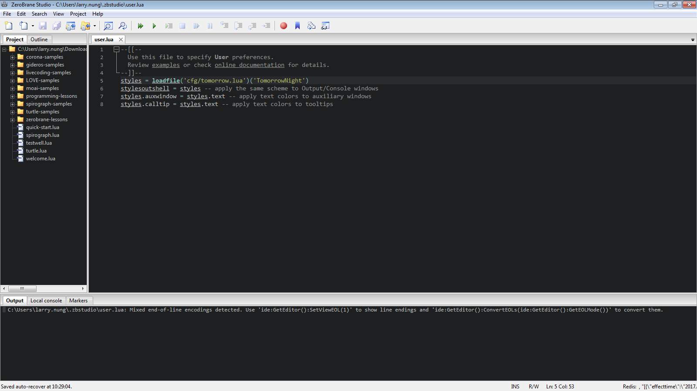

ZeroBrane Studio 內建已有不同的 color theme 可供切換使用，有需要可開啟 `cfg/tomorrow.lua` 查閱可供使用的 color theme。  

<!-- More -->



<br/>


可使用的 color theme 有 Tomorrow、TomorrowContrast、TomorrowNight、TomorrowNightEighties、TomorrowNightBlue、TomorrowNightBright、Zenburn、Monokai、Molokai、SolarizedDark、SolarizedLight、NotedPlusPlus、SciTeLuaIDE。  



<br/>


要套用到 ZeroBrane Studio 可點選 [Edit|Preferences|Settings:User] 主選單選項。  



<br/>

加上 color theme 的設定，loadfile 這邊要帶入 `cfg/tomorrow.lua` 檔，並指定要套用的 color theme。  
```lua
styles = loadfile('cfg/tomorrow.lua')('TomorrowNightEighties')
stylesoutshell = styles -- apply the same scheme to Output/Console windows
styles.auxwindow = styles.text -- apply text colors to auxiliary windows
styles.calltip = styles.text -- apply text colors to tooltips
```

<br/>




<br/>


重啟 ZeroBrane Studio 指定的 color theme 套用即會生效。  



<br/>


Link
----
* [bits.toPixels(): Changing color theme in ZeroBrane Studio](http://bitstopixels.blogspot.tw/2016/09/changing-color-theme-in-zerobrane-studio.html)
