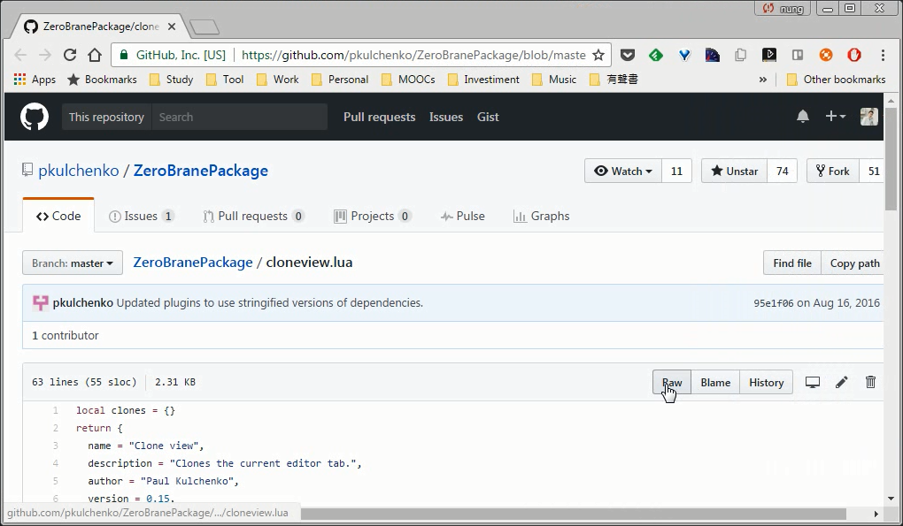
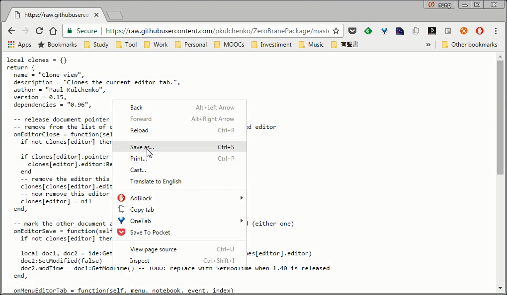
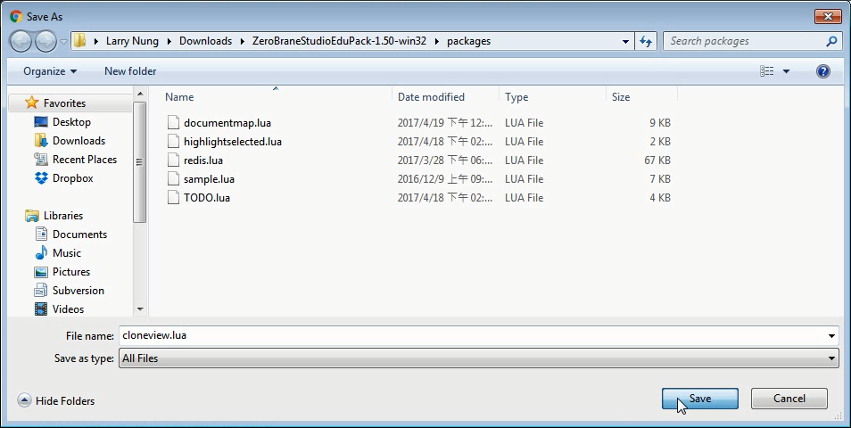
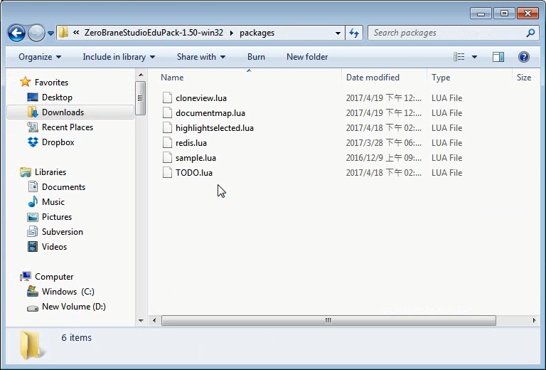
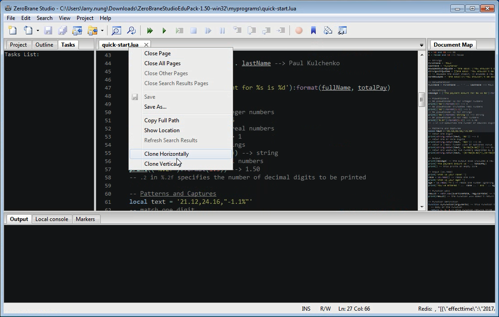
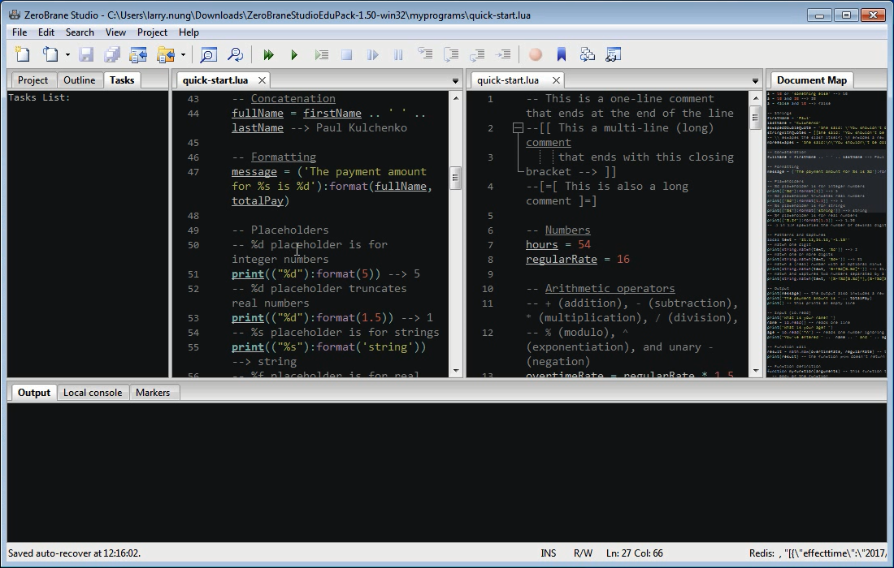
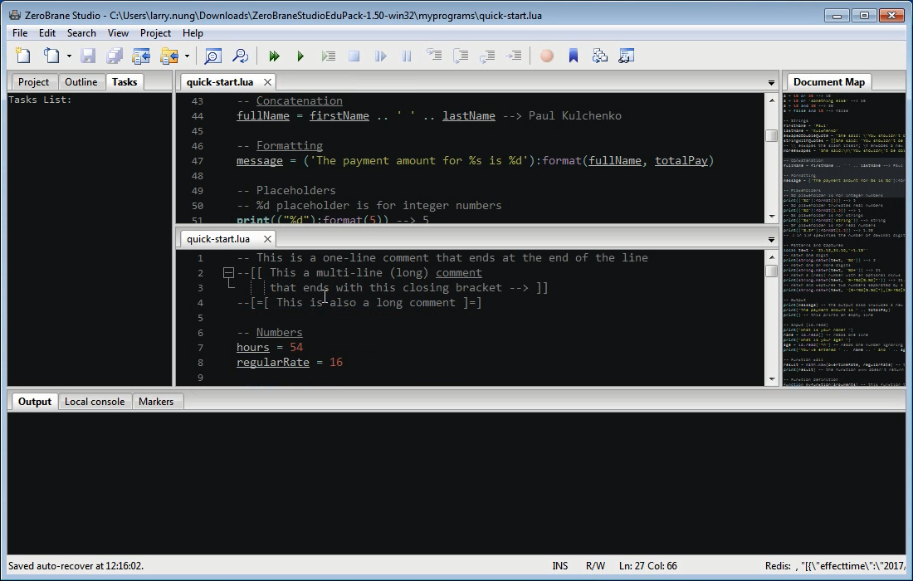

要在 ZeroBrane Studio 使用 CloneView 功能，首先要先將 [CloneView Plugin](https://github.com/pkulchenko/ZeroBranePackage/blob/master/cloneview.lua) 下載至 ZeroBrane Studio 的 packages 目錄下。

接著啟動 ZeroBrane Studio，在程式頁籤上按下滑鼠右鍵，可看到多了 'Clone Horizontally' 與 'Clone Vertically' 兩個選單選項。

點選 'Clone Horizontally' 選單選項。

ZeroBrane Studio 會將當前程式視窗複製一份水平並排。

點選 'Clone Vertically' 選單選項。

ZeroBrane Studio 則會將當前程式視窗複製一份垂直並排。

該套件在程式撰寫需要比對程式時特別好用。

Link
----
* [ZeroBranePackage/cloneview.lua at master · pkulchenko/ZeroBranePackage](https://github.com/pkulchenko/ZeroBranePackage/blob/master/cloneview.lua)