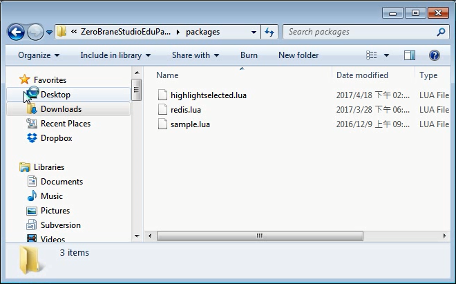
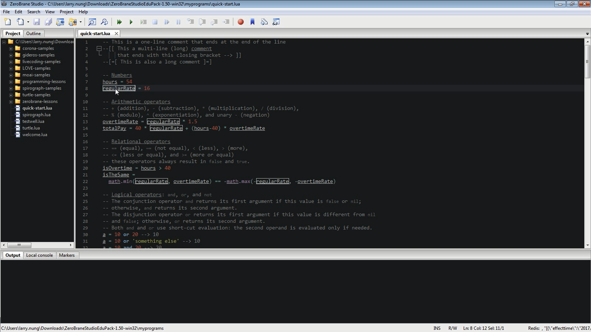

ZeroBrane Studio 預設在選取變數時並不像某些強大的編輯器一樣會將所有變數出現的地方標記，但透過安裝 [HighlightSelected Plugin](https://github.com/pkulchenko/ZeroBranePackage/blob/master/highlightselected.lua) ZeroBrane Studio 也可以提供這樣的功能。  

<!-- More -->

 

將 [HighlightSelected Plugin](https://github.com/pkulchenko/ZeroBranePackage/blob/master/highlightselected.lua) 下載下來放置在 ZeroBrane Studio 的 packages 目錄下。   

 

啟動 ZeroBrane Studio，選取變數，即會看到所有變數出現的地方會被標記。  

 

Link
----
* [ZeroBranePackage/highlightselected.lua at master · pkulchenko/ZeroBranePackage](https://github.com/pkulchenko/ZeroBranePackage/blob/master/highlightselected.lua)
