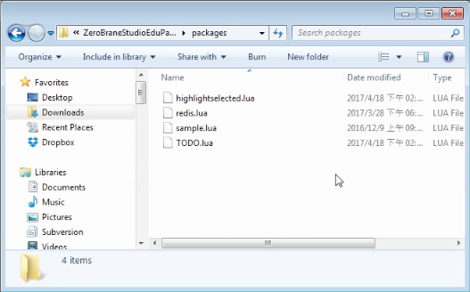
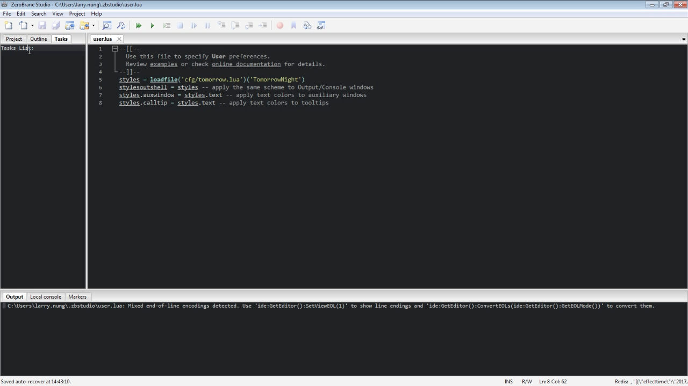
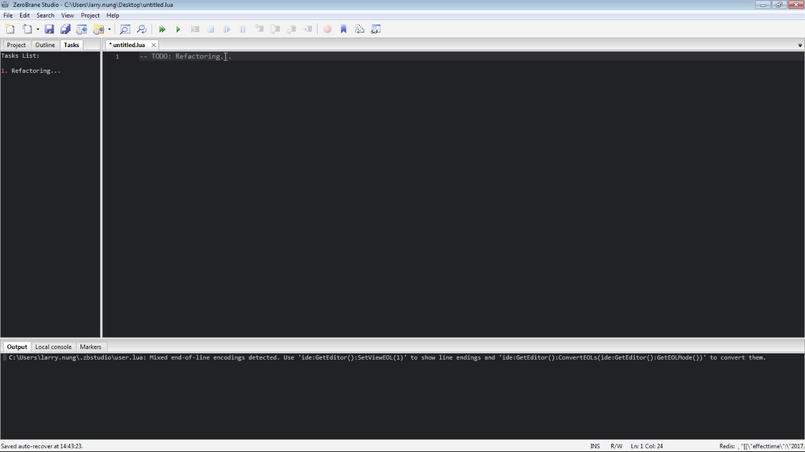

要在 ZeroBrane Studio 使用 TODO 功能，可將 [TODO Plugin](https://github.com/pkulchenko/ZeroBranePackage/blob/master/TODO.lua) 下載下來放置在 ZeroBrane Studio 的 packages 目錄下。  

<!-- More -->

 

啟動 ZeroBrane Studio，可以看到多出了個 TODO 視窗。  

 

接著在程式中加入 TODO 註解，這些註解就會顯示在 TODO 視窗內。  

 

Link
----
* [ZeroBranePackage/TODO.lua at master · pkulchenko/ZeroBranePackage](https://github.com/pkulchenko/ZeroBranePackage/blob/master/TODO.lua)
