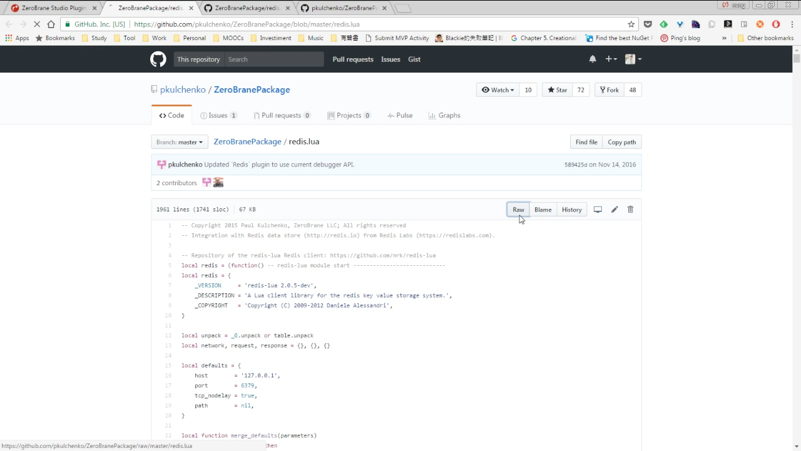
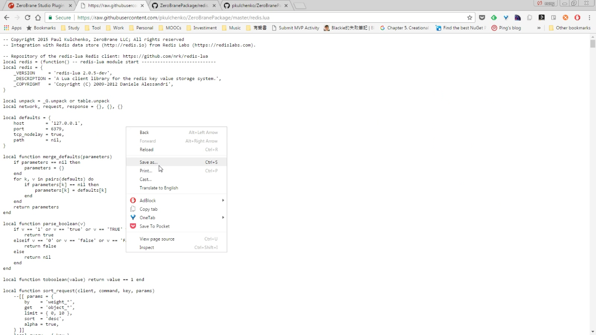
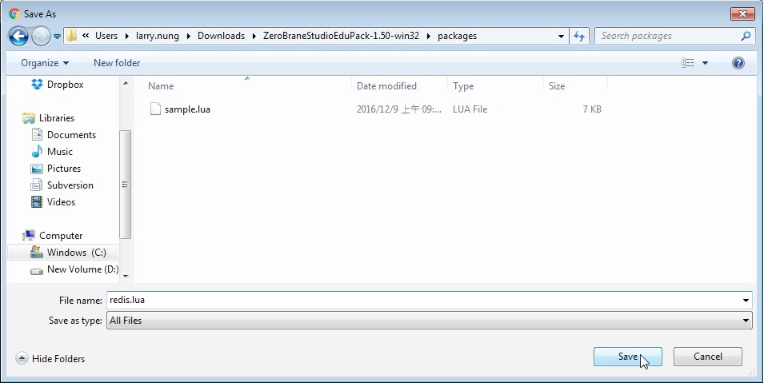
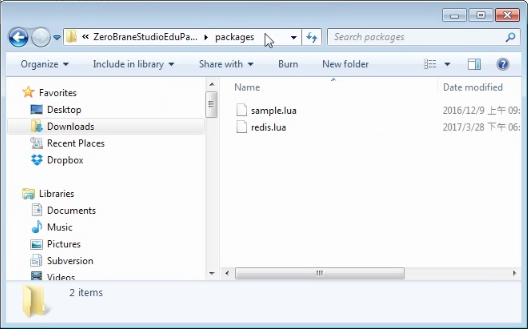
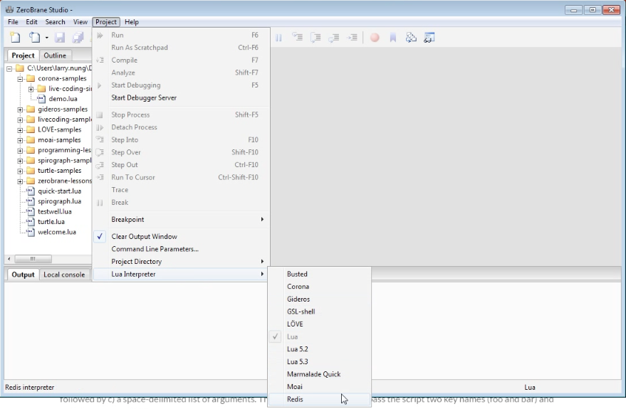
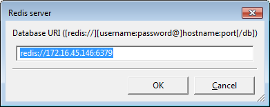
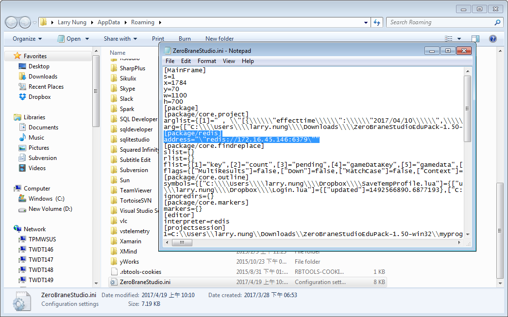
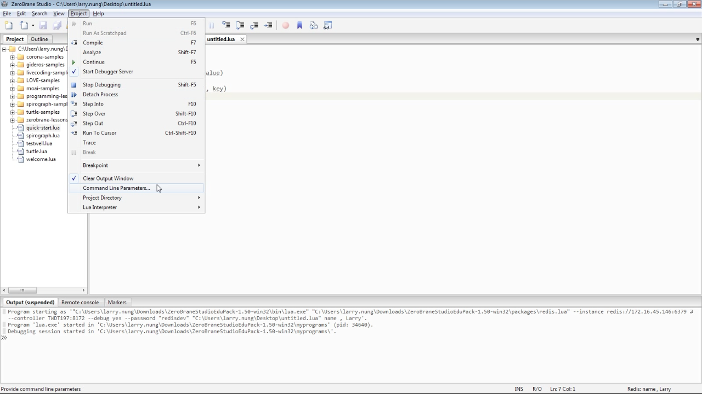
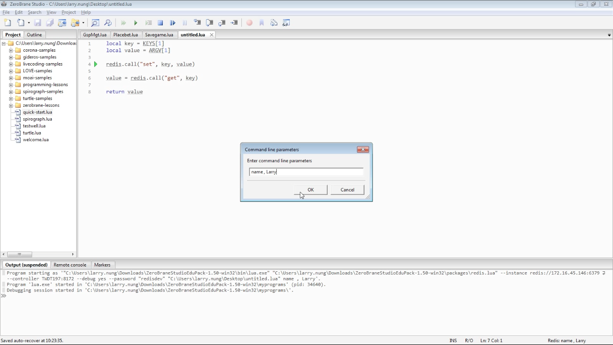
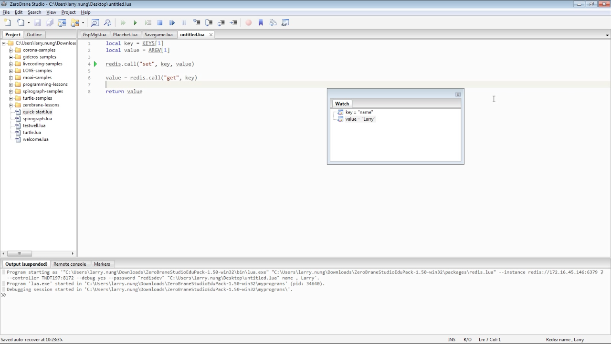

要讓 ZeroBrane Studio 支援 Redis，先要取得 [redis.lua](https://github.com/pkulchenko/ZeroBranePackage/blob/master/redis.lua)。  

<!-- More -->

 

將其內容存檔。  

 

儲存到 ZeroBrane Studio 的 packages 目錄下。  

 

 

啟動 ZeroBrane Studio，選取 [Project|Lua Interpreter|Redis] 主選單選項，將 Lua Interpreter 切為 Redis。  

 

切完後 ZeroBrane Studio 就可以支援 Redis 的 Lua Script，像是除錯、Intellisense...等。

 

載入 Redis Lua Script，按下 F5 即可開始運行，第一次運行會詢問 Redis 的位置，將 Redis 位置填入設定後即可。  

 

設定的 Redis 位置會被存放在 '%appdata%\ZeroBraneStudio.ini' 下，需要時可開啟修改。  

 

如果 Redis Lua Script 需要帶參數運行，可以選取 [Project|Command Line Parameters...] 主選單選項。  

 

帶上 Redis 運行 Lua Script 所需要的 KEYS 與 ARGV，KEYS 與 ARGV 用 "," 隔開，且分隔符號前後要有空格。  

 

設定完後運行，指定的參數即會被帶入運行。  

 

Link
----
* [ZeroBrane Studio Plugin for Redis Lua Scripts](https://redislabs.com/blog/zerobrane-studio-plugin-for-redis-lua-scripts/)
